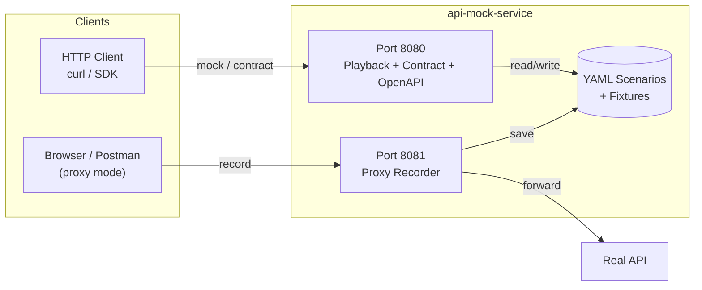

# api-mock-service

A single Go binary that mocks, records, replays, and contract-tests HTTP services. No code changes needed — point your proxy at port 8081 to record, then drive port 8080 for playback, contract testing, and fuzz/mutation testing.

[](https://go.dev)
[](LICENSE)
[](https://hub.docker.com/r/plexobject/api-mock-service)

---

## Quick Start

```bash
# Docker
docker run -p 8080:8080 -p 8081:8081 \
  -e DATA_DIR=/tmp/mocks \
  plexobject/api-mock-service:latest

# Or build from source
make && ./out/bin/api-mock-service
```

**Record** real traffic through the proxy:
```bash
export http_proxy="http://localhost:8081"
curl https://api.example.com/orders/42
```

**Playback** instantly:
```bash
curl http://localhost:8080/orders/42
```

**Run contract tests** against the real API:
```bash
api-mock-service producer-contract \
  --group orders \
  --base_url https://api.example.com \
  --spec openapi.yaml \
  --track-coverage
```

---

## Features

- **Proxy recording** — capture real traffic on port 8081, auto-generate YAML scenarios with regex assertions
- **Template-driven mock responses** — 60+ built-in functions (UUID, RandEmail, RandRegex, SeededName, …)
- **OpenAPI 3.x import** — upload a spec and get instant mock scenarios + discriminator/oneOf/anyOf variant expansion
- **Producer contract testing** — drive real APIs with fuzz data, validate response shapes and OpenAPI schema
- **Mutation testing** — null fields, boundary values, format violations, security injection (SQLi/XXE/SSRF/…)
- **Coverage reporting** — which OpenAPI paths were exercised, which were missed
- **Chaos testing** — inject errors, latency, and failures via group config

---

## Architecture


```mermaid
flowchart LR
    subgraph Clients
        A["HTTP Client\ncurl / SDK"]
        B["Browser / Postman\n(proxy mode)"]
    end
    subgraph "api-mock-service"
        P8080["Port 8080\nPlayback + Contract + OpenAPI"]
        P8081["Port 8081\nProxy Recorder"]
        Repo[("YAML Scenarios\n+ Fixtures")]
    end
    C["Real API"]

    A -->|"mock / contract"| P8080
    B -->|"record"| P8081
    P8081 -->|"forward"| C
    P8081 -->|"save"| Repo
    P8080 -->|"read/write"| Repo
```

---

## Documentation

| Guide | Description |
|-------|-------------|
| [Mock Guide](docs/mock-guide.md) | Recording, playback, templates, fixtures, chaos testing |
| [Contract Testing](docs/contract-testing.md) | Consumer + producer contracts, JSONPath assertions, schema validation, mutations, coverage |
| [Fuzz & Property Testing](docs/fuzz-property-testing.md) | Property-based testing, mutation strategies, security injection |
| [OpenAPI Guide](docs/openapi-guide.md) | Spec upload, discriminator support, Swagger UI, coverage |
| [API Reference](docs/api-reference.md) | All HTTP endpoints with examples |
| [CLI Reference](docs/cli-reference.md) | All commands and flags |

---

## Installation

```bash
# Docker Hub
docker pull plexobject/api-mock-service:latest
docker run -p 8080:8080 -p 8081:8081 \
  -e HTTP_PORT=8080 -e PROXY_PORT=8081 -e DATA_DIR=/tmp/mocks \
  plexobject/api-mock-service:latest

# Build from source (requires Go 1.21+)
git clone https://github.com/bhatti/api-mock-service
cd api-mock-service
make
./out/bin/api-mock-service

# go install
go install github.com/bhatti/api-mock-service@latest
```

---

## Swagger API Docs

Interactive API docs: https://petstore.swagger.io/?url=https://raw.githubusercontent.com/bhatti/api-mock-service/main/docs/swagger.yaml

Embedded UI (after starting the server): http://localhost:8080/_ui

---

## Related Articles

- [Property-based and Generative testing for Microservices](https://shahbhat.medium.com/property-based-and-generative-testing-for-microservices-1c6df1abb40b)
- [Mocking Distributed Microservices](https://shahbhat.medium.com/mocking-distributed-micro-services-47c0d658d4bb)
- [Contract Testing for REST APIs](https://shahbhat.medium.com/contract-testing-for-rest-apis-31680ed6bbf3)
