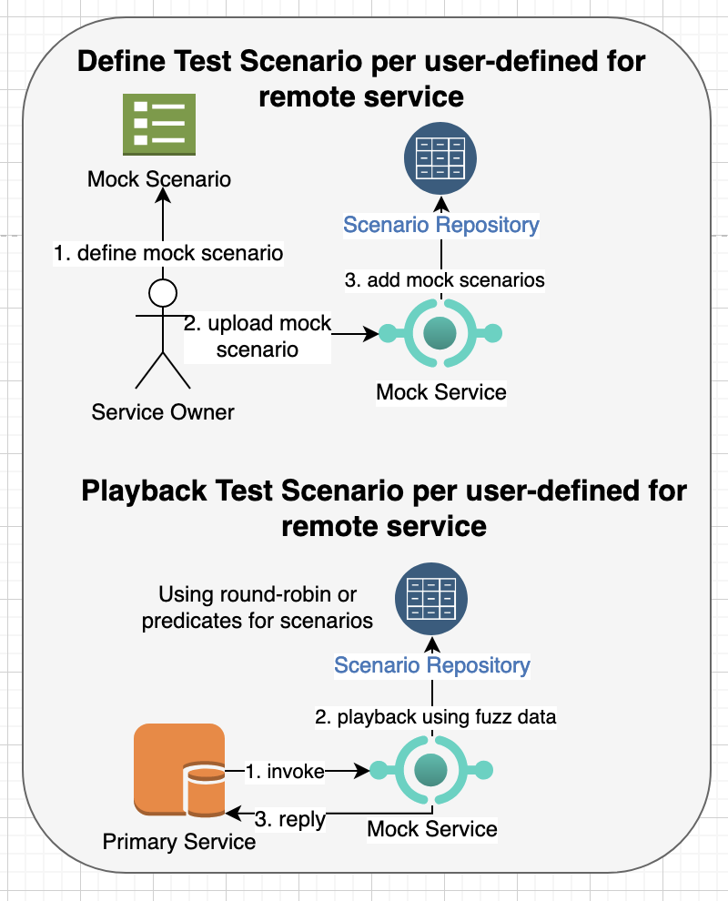
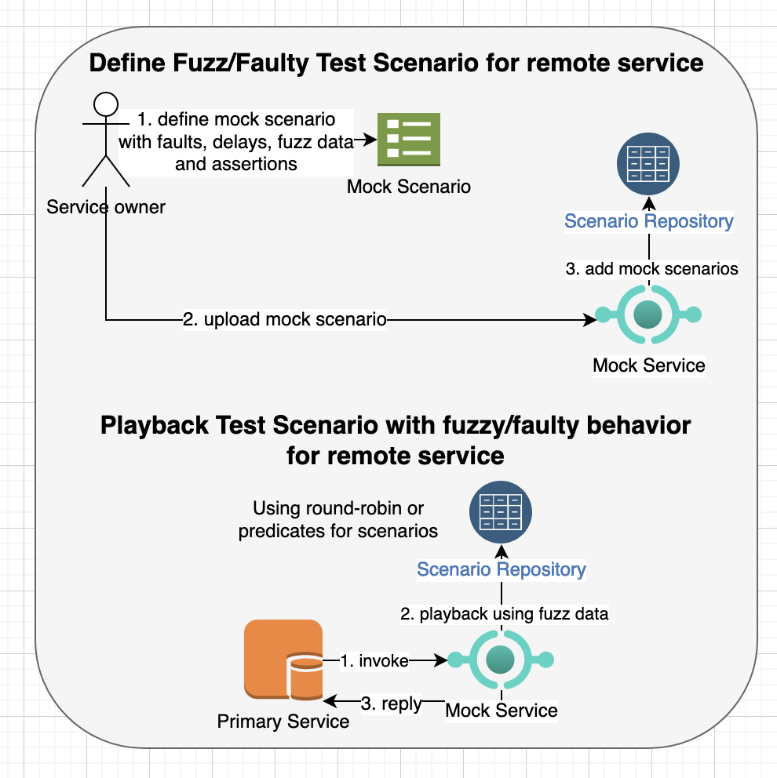
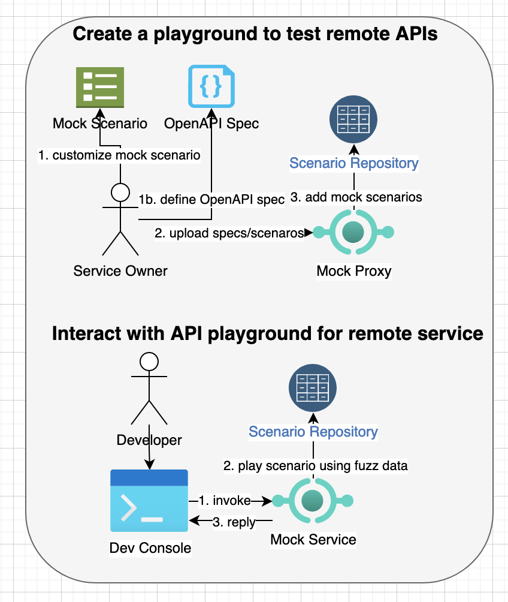

# api-mock-service

## Mocking Distributed Micro services and Contract/Fuzz testing with Record/Play, Templates, OpenAPI Specifications and Stochastic test client

### Problems with Testing

Testing methodologies such as unit-testing, integration-testing, functional-testing, chaos/contract testing/game days, etc. are a key part of software development lifecycle for
building reliable and robust software systems. However, these testing methodologies pose several problems such as:
- Tests require regular maintenance same as the code, however tests often don't receive the same attention and code rot is common with the tests. This makes the tests brittle that often break with the changes and tests become difficult to understand.
- The size of tests also pose a challenge as the code grows, which further adds development cost of syncing tests with the code updates.
- Integration/functional tests further add risks when testing for hard to reproduce conditions with real services. Also, real services keep their own state, which could be updated externally so regression testing can't be reliably performed. 
- You may need to inject failures, time delays, network failures or timeouts for chaos testing/game days, which require special tooling and development effort.
- The functional/load tests also need to check for non-functional requirements when building distributed systems such as concurrency, performance, scalability and failures. This requires not only testing for robust server side code but also testing for clients/sdks that can handle various error conditions.
- Testing for backward and forward compatibility is hard as different clients may be using a subset of functionality. This requires solid support for contract based testing from consumer's and producer's perspectives.

### Facilitate testing with the api-mock-service

The api-mock-service helps with the integration/functional/contract/chaos testing by mocking dependent services and injecting failures in the implementation. 
It allows testing both the server side and client side code with the property-based/generative/fuzzing/stochastic testing techniques.
The property-based/generative techniques reduce the size of test suites by automatically generating test input data using fuzz-data generators.

### Use-Cases

- As a service owner, I need to mock remote dependent service(s) by capturing/recording request/responses through an HTTP proxy so that I can play it back when testing the remote service(s) without connecting with them.


- As a service owner, I need to mock remote dependent service(s) based on a open-api/swagger specifications so that my service client can test all service behavior per specifications for the remote service(s) even when remote service is not fully implemented or accessible.


- As a service owner, I need to mock remote dependent service(s) based on a mock scenario defined in a template so that my service client can test service behavior per expected request/response in the template even when remote service is not fully implemented or accessible.



- As a service owner, I need to inject various response behavior and faults to the output of a remote service so that I can build a robust client that prevents cascading failures and is more resilient to unexpected faults.



- As a developer, I need a playground to try out remote service APIs and learn how the behave with different test data scenarios so that I can understand the API behavior better while referring to the API specs.



- As a service owner, I need to define test cases with faulty or fuzz responses to test my own service so that I can predict how it will behave with various input data and assert the service response based on expected behavior.


 
### Features

API mock service for REST/HTTP based services with following features:

- Record API request/response by working as a HTTP proxy server (native http/https or via API) between client and remote service.
- Playback API response that were previously recorded based on request parameters.
- Define API behavior manually by specifying request parameters and response contents using static data or dynamic data based on GO templating language.
- Generate API behavior from open standards such as Open API/Swagger and automatically create constraints and regex based on the specification. 
- Customize API behavior using a GO template language so that users can generate dynamic contents based on input parameters or other configuration. 
- Generate large responses using the template language with dynamic loops so that you can test performance of your system.
- Define multiple test scenarios for the API based on different input parameters or simulating various error cases that are difficult to reproduce with real services.
- Store API request/responses locally as files so that it’s easy to port stubbed request/responses to any machine.
- Allow users to define API request/response with various formats such as XML/JSON/YAML and upload them to the mock service.
- Support test fixtures that can be uploaded to the mock service and can be used to generate mock responses.
- Define a collection of helper methods to generate different kind of random data such as UDID, dates, URI, Regex, text and numeric data.
- Ability to playback all test scenarios or a specific scenario and change API behavior dynamically with different input parameters.
- Support multiple mock scenarios for the same API that can be selected either using round-robin order, custom predicates based on parameters or based on scenario name.
- Inject error conditions and artificial delays so that you can test how your system handles error conditions that are difficult to reproduce or use for game days/contract/chaos testing.
- Generate client requests for a remote API for contract, chaos and stochastic testing where a set of requests are sent with a dynamic data generated based on regex or other constraints.
- Create a playground for testing APIs interactively so that users can learn the APIs quickly.
- Support contract based testing from both consumer and producer sides.
- Chain group tests and execute them in a specific order so that output of a one test scenario can be used as an input to next test scenarios.

This service is based on an older mock-service https://github.com/bhatti/PlexMockServices, I wrote a while ago.
As, it's written in GO, you can either download GO runtime environment or use Docker to install it locally. 
If you haven't installed docker, you can download the community version from https://docs.docker.com/engine/installation/ 
or find installer for your OS on https://docs.docker.com/get-docker/.

```bash
docker build -t api-mock-service .
docker run -p 8000:8080 -p 8081:8081 -e HTTP_PORT=8080 -e PROXY_PORT=8081 -e DATA_DIR=/tmp/mocks \
	-e ASSET_DIR=/tmp/assets api-mock-service
```

or pull an image from docker hub (https://hub.docker.com/r/plexobject/api-mock-service), e.g.

```bash
docker pull plexobject/api-mock-service:latest
docker run -p 8000:8080 -p 8081:8081 -e HTTP_PORT=8080 -e PROXY_PORT=8081 -e DATA_DIR=/tmp/mocks \
	-e ASSET_DIR=/tmp/assets plexobject/api-mock-service:latest
```

Alternatively, you can run it locally with GO environment, e.g.,

```bash
make && ./out/bin/api-mock-service
```

For full command line options, execute api-mock-service -h that will show you command line options such as:
```bash
./out/bin/api-mock-service -h
Starts mock service

Usage:
  api-mock-service [flags]
  api-mock-service [command]

Available Commands:
  completion  Generate the autocompletion script for the specified shell
  contract    Executes contract client
  help        Help about any command
  version     Version will output the current build information

Flags:
      --assetDir string   asset dir to store static assets/fixtures
      --config string     config file
      --dataDir string    data dir to store mock scenarios
  -h, --help              help for api-mock-service
      --httpPort int      HTTP port to listen
      --proxyPort int     Proxy port to listen

Use "api-mock-service [command] --help" for more information about a command.
```

## API Docs
See Swagger API docs at https://petstore.swagger.io?url=https://raw.githubusercontent.com/bhatti/api-mock-service/main/docs/swagger.yaml

## Recording a Mock Scenario via HTTP/HTTPS Proxy
Once you have the API mock service running, the mock service will start two ports on startup, first port
(default 8080) will be used to record/play mock scenarios, updating templates or uploading OpenAPIs. The second
port (default 8081) will setup an HTTP/HTTPS proxy server that you can point to record your scenarios, e.g.
```shell
export http_proxy="http://localhost:8081"
export https_proxy="http://localhost:8081"

curl -k -v -H "Authorization: Bearer sk_test_xxxx" https://api.stripe.com/v1/customers/cus_xxx/cash_balance
```

Above curl command will automatically record all requests and responses and create mock scenario to play it back. For example, if you call the same 
API again, it will return a local response instead of contacting the server. You can customize the proxy behavior for record by adding `X-Mock-Record: true`  header to your request.

## Recording a Mock Scenario via API 
Alternatively, you can use invoke an internal API as a pass through to invoke a remote API so that you can 
automatically record API behavior and play it back later, e.g.

```bash
curl -H "X-Mock-Url: https://api.stripe.com/v1/customers/cus_**/cash_balance" \
	-H "Authorization: Bearer sk_test_***" http://localhost:8080/_proxy
```

In above example, the curl command is passing the URL of real service as an HTTP header ``X-Mock-Url``. In addition, you can pass 
other authorization headers as needed. 

## Viewing the Recorded Mock Scenario
The API mock-service will store the request/response in a YAML file under a data directory that you can specify. For example, you may see a file under:

```bash
default_mocks_data/v1/customers/cus_***/cash_balance/GET/recorded-scenario-***.scr
```

Note: the sensitive authentication or customer keys are masked in above example but you will see following contents in the captured data file:

```yaml
method: GET
name: recorded-v1-customers-cus
path: /v1/customers/cus_**/cash_balance
description: recorded at 2022-10-29 04:26:17.24776 +0000 UTC
group: v1_customers_cus_xx_cash_balance
predicate: {{NthRequest 2}}
request:
  assert_query_params_pattern: {}
  assert_headers_pattern:
    Content-Type: ""
  assert_contents_pattern: '{}'
  path_params: {}
  query_params: {}
  headers:
    Accept: '*/*'
    Authorization: Bearer sk_test_xxx
    User-Agent: curl/7.65.2
    X-Mock-Url: https://api.stripe.com/v1/customers/cus_/cash_balance
  contents: ""  
response:
  headers:
    Access-Control-Allow-Credentials:
      - "true"
    Access-Control-Allow-Methods:
      - GET, POST, HEAD, OPTIONS, DELETE
    Access-Control-Allow-Origin:
      - '*'
    Access-Control-Expose-Headers:
      - Request-Id, Stripe-Manage-Version, X-Stripe-External-Auth-Required, X-Stripe-Privileged-Session-Required
    Access-Control-Max-Age:
      - "300"
    Cache-Control:
      - no-cache, no-store
    Content-Length:
      - "168"
    Content-Type:
      - application/json
    Date:
      - Mon, 12 Dec 2022 01:21:45 GMT
    Request-Id:
      - req_xxx
    Server:
      - nginx
    Strict-Transport-Security:
      - max-age=63072000; includeSubDomains; preload
    Stripe-Version:
      - "2018-09-06"
  contents: |-
    {
      "object": "cash_balance",
      "available": null,
      "customer": "cus_xxx",
      "livemode": false,
      "settings": {
        "reconciliation_mode": "automatic"
      }
    }
  contents_file: ""
  status_code: 200
  assert_headers_pattern: {}
  assert_contents_pattern: '{"customer":"(__string__\\w+_\\w+)","livemode":"(__boolean__(false|true))","object":"(__string__\\w+_\\w+)","settings.reconciliation_mode":"(__string__\\w+)"}'
  assertions: []
wait_before_reply: 0s
```

Above example defines a mock scenario for testing /v1/customers/cus_**/cash_balance path. A test scenario includes:
### Predicate
- This is a boolean condition if you need to enable or disable a scenario test based on dynamic parameters or request count.
 
### Group
- This specifies the group for related test scenarios.

### Request Matching Parameters:
You can define match parameters based on:

- URL Query Parameters
- URL Request Headers
- Request Body
  
You can use these parameters so that test scenario is executed only when the parameters match, e.g.
```yaml
    assert_query_params_pattern:
      name: [a-z0-9]{1,50}
    assert_headers_pattern:
      Content-Type: "application/json"
```
The matching request parameters will be used to select the mock scenario to execute and you can use regular expressions to validate, 
e.g. above example will be matched if content-type is `application/json` and it will validate that name query parameter is alphanumeric from 1-50 size.


### Request Parameters:

The request parameters show the contents captured from the record/play so that you can use and customize to define matching parameters.

- URL Query Parameters
- URL Request Headers
- Request Body

### Response Properties

The response properties will include:

- Response Headers
- Response Body statically defined or loaded from a test fixture
- Response can also be loaded from a test fixture file
- Status Code
- Matching header and contents
- Assertions
You can copy recorded scenario to another folder and use templates to customize it and then upload it for playback.

The matching header and contents use `assert_headers_pattern` and `assert_contents_pattern` similar to request to validate response in case you want to test response from a real service for chaos testing.
Similarly, `assertions` defines a set of predicates to test against response from a real service:
```yaml
    assertions:
        - VariableGE contents.id 10
        - VariableContains contents.title illo
        - VariableContains headers.Pragma no-cache 
```
Above example will check API response and verify that `id` property contains `10`, `title` contains `illo` and result headers include `Pragma: no-cache` header.

## Playback the Mock API Scenario

You can playback the recorded response from above example as follows:
```bash
% curl http://localhost:8080/v1/customers/cus_***/cash_balance
```

Which will return captured response such as:

```json

{
  "object": "cash_balance",
  "available": null,
  "customer": "cus_***",
  "livemode": false,
  "settings": {
    "reconciliation_mode": "automatic"
  }
}

```

Though, you can customize your template with dynamic properties or conditional logic but you can also send HTTP headers 
for `X-Mock-Response-Status` to override HTTP status to return or `X-Mock-Wait-Before-Reply` to add artificial latency using duration syntax. 


### Debug Headers from Playback
The playback request will return mock-headers to indicate the selected mock scenario, path and request count, e.g.

```
X-Mock-Path: /v1/jobs/{jobId}/state
X-Mock-Request-Count: 13
X-Mock-Scenario: setDefaultState-bfb86eb288c9abf2988822938ef6d4aa3bd654a15e77158b89f17b9319d6f4e4
```

## Upload Mock API Scenario
You can customize the recorded scenario, e.g. you can add path variables to above API as follows:
```yaml
method: GET
name: stripe-cash-balance
path: /v1/customers/:customer/cash_balance
predicate: {{NthRequest 2}}
group: my_group
request:
  assert_headers_pattern:
    Authorization: Bearer sk_test_[0-9a-fA-F]{10}$
response:
  headers:
    Access-Control-Allow-Credentials:
      - "true"
    Access-Control-Allow-Methods:
      - GET, POST, HEAD, OPTIONS, DELETE
    Access-Control-Allow-Origin:
      - '*'
    Access-Control-Expose-Headers:
      - Request-Id, Stripe-Manage-Version, X-Stripe-External-Auth-Required, X-Stripe-Privileged-Session-Required
    Access-Control-Max-Age:
      - "300"
    Cache-Control:
      - no-cache, no-store
    Content-Type:
      - application/json
    Request-Id:
      - req_2
    Server:
      - nginx
    Strict-Transport-Security:
      - max-age=63072000; includeSubDomains; preload
    Stripe-Version:
      - "2018-09-06"
  content_type: application/json
  contents: |-
    {
      "object": "cash_balance",
      "available": null,
      "customer": {{.customer}}
      "livemode": false,
      "page": {{.page}}
      "pageSize": {{.pageSize}}
      "settings": {
        "reconciliation_mode": "automatic"
      }
    }
  status_code: 200
  assert_headers_pattern: {}
  assert_contents_pattern: '{"customer":"(__string__\\w+_\\w+)","livemode":"(__boolean__(false|true))","object":"(__string__\\w+_\\w+)","settings.reconciliation_mode":"(__string__\\w+)"}'
  assertions:
    - VariableContains contents.livemode false
    - VariableContains headers.Pragma no-cache
wait_before_reply: 1s
```

In above example, I assigned a name stripe-cash-balance to the mock scenario and changed API path to 
`/v1/customers/:customer/cash_balance` so that it can capture customer-id as a path variable. I added a regular expression to 
ensure that the HTTP request includes an Authorization header matching `Bearer sk_test_[0-9a-fA-F]{10}$` and defined dynamic properties 
such as `{{.customer}}, {{.page}} and {{.pageSize}}` so that they will be replaced at runtime.

```bash
curl -H "Content-Type: application/yaml" --data-binary @fixtures/stripe-customer.yaml \
	http://localhost:8080/_scenarios
```
and then play it back as follows:
```bash
curl -v -H "Authorization: Bearer sk_test_0123456789" \
	"http://localhost:8080/v1/customers/123/cash_balance?page=2&pageSize=55"
```

and it will generate:
```json
{
  "object": "cash_balance",
  "available": null,
  "customer": 123,
  "livemode": false,
  "page": 2,
  "pageSize": 55,
  "settings": {
    "reconciliation_mode": "automatic"
  }
}

```
As you can see, the values of customer, page and pageSize are dynamically updated. You can upload multiple mock scenarios for the same API and the mock API service will play it back sequentially. For example, you can upload another scenario for above API as follows:
```yaml
method: GET
name: stripe-customer-failure
path: /v1/customers/:customer/cash_balance
predicate: {{NthRequest 2}}
group: my_group
request:
    assert_headers_pattern:
        Authorization:
            - Bearer sk_test
response:
    headers:
        Stripe-Version:
            - "2018-09-06"
    content_type: application/json
    contents: My custom error
    status_code: 500
wait_before_reply: 1s
```
And then play it back:
```bash
curl -v "http://localhost:8080/v1/customers/123/cash_balance?page=2&pageSize=55"
```
which will return response with following error response
```
> GET /v1/customers/123/cash_balance?page=2&pageSize=55 HTTP/1.1
> Host: localhost:8080
> User-Agent: curl/7.65.2
> Accept: */*
> Authorization: Bearer sk_test_0123456789
>
* Mark bundle as not supporting multiuse
< HTTP/1.1 500 Internal Server Error
< Content-Type: application/json
< X-Mock-Request-Count: 1
< X-Mock-Scenario: stripe-customer-failure
< Stripe-Version: 2018-09-06
< Vary: Origin
< Date: Sat, 29 Oct 2022 17:29:15 GMT
< Content-Length: 15
```

## Dynamic Templates with Mock API Scenarios
You can use loops and conditional primitives of template language (https://golangdocs.com/templates-in-golang) to generate dynamic responses as follows:
```yaml
method: GET
name: get_devices
path: /devices
description: ""
predicate: ""
group: devices
request:
    assert_headers_pattern:
      Content-Type: "application/json; charset=utf-8"
response:
    headers:
        "Server":
            - "SampleAPI"
        "Connection":
            - "keep-alive"
    content_type: application/json
    contents: >
     {
     "Devices": [
{{- range $val := Iterate .pageSize }}
      {
        "UUID": "{{SeededUUID $val}}",
        "Line": { {{SeededFileLine "lines.txt" $val}}, "Type": "Public", "IsManaged": false },
        "Amount": {{JSONFileProperty "props.yaml" "amount"}},
        "SerialNumber": "{{UUID}}",
        "MacAddress": "{{UUID}}",
        "Imei": "{{UUID}}",
        "AssetNumber": "{{RandString 20}}",
        "LocationGroupId": {
         "Id": {
           "Value": {{RandNumMax 1000}},
         },
         "Name": "{{SeededCity $val}}",
         "UUID": "{{UUID}}"
        },
        "DeviceFriendlyName": "Device for {{SeededName $val}}",
        "LastSeen": "{{Time}}",
        "Email": "{{RandEmail}}",
        "Phone": "{{RandPhone}}",
        "EnrollmentStatus": {{SeededBool $val}}
        "ComplianceStatus": {{RandRegex "^AC[0-9a-fA-F]{32}$"}}
        "Group": {{RandCity}},
        "Date": {{TimeFormat "3:04PM"}},
        "BatteryLevel": "{{RandNumMax 100}}%",
        "StrEnum": {{EnumString "ONE TWO THREE"}},
        "IntEnum": {{EnumInt 10 20 30}},
        "ProcessorArchitecture": {{RandNumMax 1000}},
        "TotalPhysicalMemory": {{RandNumMax 1000000}},
        "VirtualMemory": {{RandNumMax 1000000}},
        "AvailablePhysicalMemory": {{RandNumMax 1000000}},
        "CompromisedStatus": {{RandBool}},
        "Add": {{Add 2 1}},
        "Dict": {{Dict "one" 1 "two" 2 "three" 3}}
      }{{if LastIter $val $.PageSize}}{{else}},  {{end}}
{{ end }}
     ],
     "Page": {{.page}},
     "PageSize": {{.pageSize}},
     "Total": {{.pageSize}}
     }
    {{if NthRequest 10 }}
    status_code: {{EnumInt 500 501}}
    {{else}}
    status_code: {{EnumInt 200 400}}
    {{end}}
wait_before_reply: {{.page}}s
```
Above example includes a number of template primitives and custom functions to generate dynamic contents such as:
### Loops
GO template support loops that can be used to generate multiple data entries in the response, e.g.
```yaml
{{- range $val := Iterate .pageSize }}
```

### Artificial Delays
You can specify artificial delay for the API request as follows:
```yaml
wait_before_reply: {{.page}}s
```
Above example shows delay based on page number but you can use any parameter to customize this behavior.

### Builtin functions
Go template allows custom functions that can provide customized behavior for generating test data, e.g.:
#### Add numbers
```yaml
  "Num": "{{Add 1 2}}",
```

#### Date/Time
```yaml
  "LastSeen": "{{Time}}",
  "Date": {{Date}},
  "DateFormatted": {{TimeFormat "3:04PM"}},
  "LastSeen": "{{Time}}",
```

#### Comparison
```yaml
  {{if EQ .MyVariable 10 }}
  {{if GE .MyVariable 10 }}
  {{if GT .MyVariable 10 }}
  {{if LE .MyVariable 10 }}
  {{if LT .MyVariable 10 }}
  {{if Nth .MyVariable 10 }}
```

#### Enums
```yaml
  "StrEnum": {{EnumString "ONE TWO THREE"}},
  "IntEnum": {{EnumInt 10 20 30}},
```

### Random Data
```yaml
  "SerialNumber": "{{UUID}}",
  "AssetNumber": "{{RandString 20}}",
  "LastSeen": "{{Time}}",
  "Host": "{{RandHost}}",
  "Email": "{{RandEmail}}",
  "Phone": "{{RandPhone}}",
  "URL": "{{RandURL}}",
  "EnrollmentStatus": {{SeededBool $val}}
  "ComplianceStatus": {{RandRegex "^AC[0-9a-fA-F]{32}$"}}
  "City": {{RandCity}},
  "Country": {{RandCountry}},
  "CountryCode": {{RandCountryCode}},
  "Completed": {{RandBool}},
  "Date": {{TimeFormat "3:04PM"}},
  "BatteryLevel": "{{RandNumMax 100}}%",
  "Object": "{{RandDict}}",
  "IntHistory": {{RandIntArrayMinMax 1 10}},
  "StringHistory": {{RandStringArrayMinMax 1 10}},
  "FirstName": "{{SeededName 1 10}}",
  "LastName": "{{RandName}}",
  "Score": "{{RandNumMinMax 1 100}}",
  "Paragraph": "{{RandParagraph 1 10}}",
  "Word": "{{RandWord 1 1}}",
  "Sentence": "{{RandSentence 1 10}}",
  "Colony": "{{RandString}}",
```

### Request count and Conditional Logic
```yaml
{{if NthRequest 10 }}   -- for every 10th request
{{if GERequest 10 }}    -- if number of requests made to API so far are >= 10
{{if LTRequest 10 }}    -- if number of requests made to API so far are < 10
```

The template syntax allows you to define a conditional logic such as:
```yaml
    {{if NthRequest 10 }}
    status_code: {{AnyInt 500 501}}
    {{else}}
    status_code: {{AnyInt 200 400}}
    {{end}}
```
In above example, the mock API will return HTTP status 500 or 501 for every 10th request and 200 or 400 for other requests. You can use conditional syntax to simulate different error status or customize response.


### Loops
```yaml
  {{- range $val := Iterate 10}}

     {{if LastIter $val 10}}{{else}},{{end}}
  {{ end }}
```

### Variables
```yaml
     {{if VariableContains "contents" "blah"}}
     {{if VariableEquals "contents" "blah"}}
     {{if VariableSizeEQ "contents" "blah"}}
     {{if VariableSizeGE "contents" "blah"}}
     {{if VariableSizeLE "contents" "blah"}}
     {{if VariableEQ "contents.num" 20}}
     {{if VariableGE "contents.num" 10}}
     {{if VariableLE "contents.num" 5}}
```

### Test fixtures
The mock service allows you to upload a test fixture that you can refer in your template, e.g. 
```bash
  "Line": { {{SeededFileLine "lines.txt" $val}}, "Type": "Public", "IsManaged": false },
```
Above example loads a random line from a lines.txt fixture. As you may need to generate a deterministic random data in some cases, 
you can use Seeded functions to generate predictable data so that the service returns same data. Following example will read a 
text fixture to load a property from a file:
```bash
  "Amount": {{JSONFileProperty "props.yaml" "amount"}},
```

This template file will generate content as follows:
```json
{ "Devices": [
 {
   "UUID": "fe49b338-4593-43c9-b1e9-67581d000000",
   "Line": { "ApplicationName": "Chase", "Version": "3.80", "ApplicationIdentifier": "com.chase.sig.android", "Type": "Public", "IsManaged": false },
   "Amount": {"currency":"$","value":100},
   "SerialNumber": "47c2d7c3-c930-4194-b560-f7b89b33bc2a",
   "MacAddress": "1e015eac-68d2-42ee-9e8f-73fb80958019",
   "Imei": "5f8cae1b-c5e3-4234-a238-1c38d296f73a",
   "AssetNumber": "9z0CZSA03ZbUNiQw2aiF",
   "LocationGroupId": {
    "Id": {
      "Value": 980
    },
    "Name": "Houston",
    "UUID": "3bde6570-c0d4-488f-8407-10f35902cd99"
   },
   "DeviceFriendlyName": "Device for Alexander",
   "LastSeen": "2022-10-29T11:25:25-07:00",
   "Email": "john.smith@abc.com",
   "Phone": "1-408-454-1507",
   "EnrollmentStatus": true,
   "ComplianceStatus": "ACa3E07B0F2cA00d0fbFe88f5c6DbC6a9e",
   "Group": "Chicago",
   "Date": "11:25AM",
   "BatteryLevel": "43%",
   "StrEnum": "ONE",
   "IntEnum": 20,
   "ProcessorArchitecture": 243,
   "TotalPhysicalMemory": 320177,
   "VirtualMemory": 768345,
   "AvailablePhysicalMemory": 596326,
   "CompromisedStatus": false,
   "Add": 3
 },
...
 ], "Page": 2, "PageSize": 55, "Total": 55 }  
```

## Playing back a specific mock scenario
You can pass a header for ``X-Mock-Scenario`` to specify the name of scenario if you have multiple scenarios for the same API, e.g. 
```bash
curl -v -H "X-Mock-Scenario: stripe-cash-balance" -H "Authorization: Bearer sk_test_0123456789" \
	"http://localhost:8080/v1/customers/123/cash_balance?page=2&pageSize=55"
```

You can also customize response status by overriding the request header with `X-Mock-Response-Status` and delay before return by
overriding `X-Mock-Wait-Before-Reply` header.

## Using Test Fixtures
You can define a test data in your test fixtures and then upload as follows:
```bash
curl -H "Content-Type: application/yaml" --data-binary @fixtures/lines.txt \
	http://localhost:8080/_fixtures/GET/lines.txt/devices
	
curl -v -H "Content-Type: application/yaml" --data-binary @fixtures/props.yaml \
    http://localhost:8080/_fixtures/GET/props.yaml/devices	
```

In above example, test fixtures for `lines.txt` and `props.yaml` will be uploaded and will be available for all `GET` requests 
under `/devices` URL path. You can then refer to above fixture in your templates. You can also use this to serve any binary files, 
e.g. you can define an image template file as follows:

```yaml
method: GET
name: test-image
path: /images/mock_image
description: ""
predicate: ""
request:
response:
    headers:
      "Last-Modified":
        - {{Time}}
      "ETag":
        - {{RandString 10}}
      "Cache-Control":
        - max-age={{RandNumMinMax 1000 5000}}
    content_type: image/png
    contents_file: mockup.png
    status_code: 200
```

Then upload a binary image using:
```bash
curl -H "Content-Type: application/yaml" --data-binary @fixtures/mockup.png \
	http://localhost:8080/_fixtures/GET/mockup.png/images/mock_image
```

And then serve the image using:
```bash
curl -v "http://localhost:8080/images/mock_image"
```

## Custom Functions 
### Numeric Random Data

Following functions can be used to generate numeric data within a range or with a seed to always generate deterministic test data:

- Random
- SeededRandom
- RandNumMinMax
- RandIntArrayMinMax

### Text Random Data

Following functions can be used to generate numeric data within a range or with a seed to always generate deterministic test data:

- RandStringMinMax
- RandStringArrayMinMax
- RandRegex
- RandEmail
- RandPhone
- RandDict
- RandCity
- RandName
- RandParagraph
- RandPhone
- RandSentence
- RandString
- RandStringMinMax
- RandWord

### Email/Host/URL

- RandURL
- RandEmail
- RandHost

### Boolean

Following functions can be used to generate boolean data:

- RandBool
- SeededBool

### UDID

Following functions can be used to generate UDIDs:

- UUID
- SeededUUID

### String Enums

Following functions can be used to generate a string from a set of Enum values:

- EnumString

### Integer Enums

Following functions can be used to generate an integer from a set of Enum values:

-  EnumInt

### Random Names

Following functions can be used to generate random names:

- RandName
- SeededName

### City Names

Following functions can be used to generate random city names:

- RandCity
- SeededCity

### Country Names or Codes

Following functions can be used to generate random country names or codes:

- RandCountry
- SeededCountry
- RandCountryCode
- SeededCountryCode

### File Fixture

Following functions can be used to generate random data from a fixture file:

- RandFileLine
- SeededFileLine
- FileProperty
- JSONFileProperty
- YAMLFileProperty

## Generate Mock API Behavior from OpenAPI or Swagger Specifications
If you are using Open API (https://www.openapis.org/) or Swagger for API specifications, you can simply upload a YAML based API specification. For example, here is a sample Open API specification from Twilio:
```yaml
openapi: 3.0.1
paths:
  /v1/AuthTokens/Promote:
    servers:
    - url: https://accounts.twilio.com
    description: Auth Token promotion
    x-twilio:
      defaultOutputProperties:
      - account_sid
      - auth_token
      - date_created
      pathType: instance
      mountName: auth_token_promotion
    post:
      description: Promote the secondary Auth Token to primary. After promoting the
        new token, all requests to Twilio using your old primary Auth Token will result
        in an error.
      responses:
        '200':
          content:
            application/json:
              schema:
                $ref: '#/components/schemas/accounts.v1.auth_token_promotion'
          description: OK
      security:

...


   schemas:
     accounts.v1.auth_token_promotion:
       type: object
       properties:
         account_sid:
           type: string
           minLength: 34
           maxLength: 34
           pattern: ^AC[0-9a-fA-F]{32}$
           nullable: true
           description: The SID of the Account that the secondary Auth Token was created
             for
         auth_token:
           type: string
           nullable: true
           description: The promoted Auth Token
         date_created:
           type: string
           format: date-time
           nullable: true
           description: The ISO 8601 formatted date and time in UTC when the resource
             was created
         date_updated:
           type: string
           format: date-time
           nullable: true
           description: The ISO 8601 formatted date and time in UTC when the resource
             was last updated
         url:
           type: string
           format: uri
           nullable: true
           description: The URI for this resource, relative to `https://accounts.twilio.com`
...         
```

You can then upload the API specification as:
```bash
curl -H "Content-Type: application/yaml" --data-binary @fixtures/oapi/twilio_accounts_v1.yaml \
		http://localhost:8080/_oapi
```

It will generate a mock scenarios for each API based on mime-type, status-code, parameter formats, regex, data ranges, e.g.,

```yaml
method: POST
name: UpdateAuthTokenPromotion-eb3708edc5bbb05dbc7894000b1e032c3c29d40475834163797b7c5e7c368097
path: /v1/AuthTokens/Promote
description: Promote the secondary Auth Token to primary. After promoting the new token, all requests to Twilio using your old primary Auth Token will result in an error.
group: v1_AuthTokens_Promote
predicate: ""
request:
    assert_query_params_pattern: {}
    assert_headers_pattern: {}
    assert_contents_pattern: '{}'
    path_params: {}
    query_params: {}
    headers: {}
    contents: ""
response:
    headers: {}
    contents: |>
      {"account_sid":"{{RandRegex `^AC[0-9a-fA-F]{32}$`}}",
      "auth_token":"{{RandStringMinMax 0 0}}","date_created":"{{Time}}",
      "date_updated":"{{Time}}","url":"{{RandURL}}"}
    contents_file: ""
    status_code: 200
    assert_headers_pattern: {}
    assert_contents_pattern: '{"account_sid":"(__string__^AC[0-9a-fA-F]{32}$)","auth_token":"(__string__\\w+)"}'
    assertions: []
wait_before_reply: 0s
```

In above example, the account_sid uses regex to generate data and URI format to generate URL. Then invoke the mock API as:

```bash
curl -v -X POST http://localhost:8080/v1/AuthTokens/Promote
```

Which will generate dynamic response as follows:

```json
{
  "account_sid": "ACF3A7ea7f5c90f6482CEcA77BED07Fb91",
  "auth_token": "PaC7rKdGER73rXNi6rVKZMN1Jw0QYxPFeEkqyvnM7Ojw2nziOER7SMWkIV6N2hXYTKxAfDMfS9t0",
  "date_created": "2022-10-29T11:54:46-07:00",
  "date_updated": "2022-10-29T11:54:46-07:00",
  "url": "https://Billy.com"
}
```
## Listing all Mock Scenarios
You can list all available mock APIs using:
```shell
curl -v http://localhost:8080/_scenarios
```
Which will return summary of APIs such as:

```json
{
  "/_scenarios/GET/FetchCredential-8b2fcf02dfb7dc190fb735a469e1bbaa3ccb5fd1a24726976d110374b13403c6/v1/Credentials/{Sid}": {
    "method": "GET",
    "name": "FetchCredential-8b2fcf02dfb7dc190fb735a469e1bbaa3ccb5fd1a24726976d110374b13403c6",
    "path": "/v1/Credentials/{Sid}",
    "assert_query_params_pattern": {},
    "assert_headers_pattern": {},
    "match_content_type": "",
    "assert_contents_pattern": "",
    "LastUsageTime": 0,
    "RequestCount": 0
  },
  "/_scenarios/GET/FetchCredentialPublicKey-60a01dcea5290e6d429ce604c7acf5bd59606045fc32c0bc835e57ac2b1b8eb6/v1/Credentials/PublicKeys/{Sid}": {
    "method": "GET",
    "name": "FetchCredentialPublicKey-60a01dcea5290e6d429ce604c7acf5bd59606045fc32c0bc835e57ac2b1b8eb6",
    "path": "/v1/Credentials/PublicKeys/{Sid}",
    "assert_query_params_pattern": {},
    "assert_headers_pattern": {},
    "match_content_type": "",
    "assert_contents_pattern": "",
    "LastUsageTime": 0,
    "RequestCount": 0
  },
  "/_scenarios/GET/ListCredential-28717701f05de4374a09ec002066d308043e73e30f25fec2dcd4c3d3c001d300/v1/Credentials": {
    "method": "GET",
    "name": "ListCredential-28717701f05de4374a09ec002066d308043e73e30f25fec2dcd4c3d3c001d300",
    "path": "/v1/Credentials",
    "assert_query_params_pattern": {
      "PageSize": "\\d+"
    },
    "assert_headers_pattern": {},
    "match_content_type": "",
    "assert_contents_pattern": "",
    "LastUsageTime": 0,
    "RequestCount": 0
  },
...  
```

## Swagger-UI
The api-mock-service includes an embdded swagger-ui, which you can access using `http://localhost:8000/swagger/` URL in your browser. And upload OpenAPI specification using:

```bash
curl -H "Content-Type: application/yaml" --data-binary @fixtures/oapi/jobs-openapi.json http://localhost:8000/_oapi
```

Alternatively, you can start swagger-UI as follows:


```bash
docker run -p 8080:8080 -e BASE_URL=/swagger -e SWAGGER_JSON=/data/jobs-openapi.json -v $(pwd)/fixtures/oapi:/data swaggerapi/swagger-ui
```
You can then play with APIs on your browser with URL `http://localhost:8080`:


## Contract Testing

This tool can be used for consumer-driven contract testing by generating stub responses and producer-driven contract testing by generating tests, e.g.

### Generate stub responses for consumer driven contract testing using Open-API


### Generate stub responses for consumer driven contract testing using user-defined specifications


### Generate tests for producer-driven contract testing using Open-API or user-defined specifications


### Generate stub responses and producer tests by recording interactions between a consumer and a producer


### Generate stub responses for interacive API playground


## Contract Testing CLI
In addition to serving a mock service, you can also use a builtin contract client to test remote services for stochastic testing
by generating random data based on regex or API specifications.
For example, you may capture a test scenario for a remote API using http proxy such as:

```bash
export http_proxy="http://localhost:8081"
export https_proxy="http://localhost:8081"
curl -k -X POST https://jsonplaceholder.typicode.com/todos -d '{ "userId": 1, "id": 1, "title": "delectus aut autem", "completed": false }'
```

This will capture a mock scenario such as:
```yaml
method: POST
name: recorded-todos-6ded24d43a7d3d65430958b467fbfbe75fe5bb9dfb7bb5821e4b3a0c5ac0f6c5
path: /todos
description: recorded at 2022-12-17 06:45:12.957308 +0000 UTC for https://jsonplaceholder.typicode.com:443/todos
order: 0
group: todos
predicate: ""
request:
    assert_query_params_pattern: {}
    assert_headers_pattern:
        Content-Type: application/x-www-form-urlencoded
    assert_contents_pattern: '{"completed":"(__boolean__(false|true))","id":"(__number__[+-]?[0-9]{1,10})","title":"(__string__\\w+)","userId":"(__number__[+-]?[0-9]{1,10})"}'
    path_params: {}
    query_params: {}
    headers:
        Accept: '*/*'
        Content-Length: "75"
        Content-Type: application/x-www-form-urlencoded
        User-Agent: curl/7.65.2
    contents: '{ "userId": 1, "id": 1, "title": "delectus aut autem", "completed": false }'
response:
    headers:
        Access-Control-Allow-Credentials:
            - "true"
        Access-Control-Expose-Headers:
            - Location
        Alt-Svc:
            - h3=":443"; ma=86400, h3-29=":443"; ma=86400
        Cache-Control:
            - no-cache
        Cf-Cache-Status:
            - DYNAMIC
        Cf-Ray:
            - 77adb1d3bab8c4ed-SEA
        Connection:
            - keep-alive
        Content-Length:
            - "110"
        Content-Type:
            - application/json; charset=utf-8
        Date:
            - Sat, 17 Dec 2022 06:45:13 GMT
        Etag:
            - W/"6e-RK9/3wRHz0Km8441rbi3vda+OPg"
        Expires:
            - "-1"
        Location:
            - http://jsonplaceholder.typicode.com/todos/201
        Nel:
            - '{"success_fraction":0,"report_to":"cf-nel","max_age":604800}'
        Pragma:
            - no-cache
        Report-To:
            - '{"endpoints":[{"url":"https:\/\/a.nel.cloudflare.com\/report\/v3?s=qMvfKDkgk2LDTsTQbgkEKwlwh0sbesM6eL3i6EPw0SffJFI21E5X1W16zULSrK2BG34ZOGaAe93KUm%2ByGY9r2UeE0MzTS4BBNK9NhUb5x14k0%2BXhOE%2FgHuW13yKlszX45O04%2FtFGo%2BHt1GLytp54"}],"group":"cf-nel","max_age":604800}'
        Server:
            - cloudflare
        Server-Timing:
            - cf-q-config;dur=8.000002708286e-06
        Vary:
            - Origin, X-HTTP-Method-Override, Accept-Encoding
        Via:
            - 1.1 vegur
        X-Content-Type-Options:
            - nosniff
        X-Powered-By:
            - Express
        X-Ratelimit-Limit:
            - "1000"
        X-Ratelimit-Remaining:
            - "999"
        X-Ratelimit-Reset:
            - "1671259562"
    contents: |-
        {
          "{ \"userId\": 1, \"id\": 1, \"title\": \"delectus aut autem\", \"completed\": false }": "",
          "id": 201
        }
    contents_file: ""
    status_code: 201
    assert_headers_pattern: {}
    assert_contents_pattern: '{"id":"(__number__[+-]?[0-9]{1,10})","{ \"userId\": 1, \"id\": 1, \"title\": \"delectus aut autem\", \"completed\": false }":"(__string__[a-z]{1,10})"}'
    pipe_properties: []
    assertions: []
wait_before_reply: 0s
```

You can then customize this scenario with additional assertions and you may remove all response contents as they won't be used. Note that
above scenario is defined with group `todos`. You can then submit a request for contract testing as follows:
```bash
curl -k -v -X POST http://localhost:8080/_contracts/todos -d '{"base_url": "https://jsonplaceholder.typicode.com", "execution_times": 2}'
```

Above request will submit 10 requests to the todo server with random data and return response such as:
```yaml
{
  "results": {
    "recorded-todos-6ded24d43a7d3d65430958b467fbfbe75fe5bb9dfb7bb5821e4b3a0c5ac0f6c5_0": {
      "id": 201,
      "{\"completed\":\"false\",\"id\":\"6\",\"title\":\"indagabit\",\"userId\":\" 9\"}": ""
    },
    "recorded-todos-6ded24d43a7d3d65430958b467fbfbe75fe5bb9dfb7bb5821e4b3a0c5ac0f6c5_1": {
      "id": 201,
      "{\"completed\":\"false\",\"id\":\"0\",\"title\":\"malitia\",\"userId\":\" 5\"}": ""
    }
  },
  "errors": {},
  "succeeded": 2,
  "failed": 0
}
```

If you have a local captured data, you can also run contract client with a command line without running mock server, e.g.:
```bash
go run main.go contract --base_url https://jsonplaceholder.typicode.com --group todos --times 10
```

## Chaining Scenarios for Group Contract Testing
A mock scenario can be defined with a group, an order and a pipeline for passing response from one scenario to another. 
You can capture or define multiple scenarios for a group and then execute them in a specific order and then pass certain properties 
from one test to another. For example, following scenario creates a todo item with order 0 and captures `id` and `title` properties:
```yaml
method: POST
name: post-todo
path: /todos
order: 0
group: todos
predicate: ""
request:
    assert_query_params_pattern: {}
    assert_headers_pattern:
        Mock-Url: https://jsonplaceholder.typicode.com/todos/2
        x-api-key: '[\x20-\x7F]{1,128}'
        Content-Type: application/x-www-form-urlencoded
    assert_contents_pattern: '{"completed":"(__boolean__(false|true))","id":"(__number__[+-]?[0-9]{1,10})","title":"(__string__\\w+)","userId":"(__number__[+-]?[0-9]{1,10})"}'
    path_params:
        id: '\d{3}'
response:
    headers:
        Access-Control-Allow-Credentials:
            - "true"
    content_type: ""
    contents: |-
        {
          "id": {{RandNumMinMax 1 10}}
        }
    status_code: 200
    assert_contents_pattern: '{"id":"(__number__[+-]?[0-9]{1,10})","{ \"userId\": 1, \"id\": 1, \"title\": \"delectus aut autem\", \"completed\": false }":"(__string__[a-z]{1,10})"}'
    pipe_properties:
      - id
      - title
    assertions:
      - VariableGE contents.id 0
wait_before_reply: 1s
```

The pipeline properties can be used as input parameters for another scenario such as:
```yaml
method: GET
name: todo-get
path: /todos/:id
order: 1
group: todos
request:
    assert_query_params_pattern: {}
    assert_headers_pattern:
        Mock-Url: https://jsonplaceholder.typicode.com/todos/10
        x-api-key: '[\x20-\x7F]{1,32}'
    headers:
        x-api-key: '[\x20-\x7F]{1,32}'
    query_params:
        group: '[a-zA-Z]{5,10}'
    path_params:
        id: '[0-9]{4,10}'
    match_content_type: ""
    assert_contents_pattern: ""
response:
    headers: {}
    content_type: ""
    contents: |-
        {
                        "userId": 15,
                        "id": {{.id}},
                        "title": "illo test title",
                        "completed": true
                  }
    assert_contents_pattern: '{"completed":"(__boolean__(false|true))","id":"(__number__[+-]?[0-9]{1,10})","title":"(__string__\\w+)","userId":"(__number__[+-]?[0-9]{1,10})"}'
    pipe_properties:
      - id
      - userId
    status_code: 200
    assertions:
        - VariableGE contents.userId 0
        - VariableContains contents.title illo
wait_before_reply: 1s
```

When you execute contract tests using `curl -k -v -X POST http://localhost:8080/_contracts/todos -d '{"base_url": "https://jsonplaceholder.typicode.com", "execution_times": 2}'`, it will execute:
```yaml
{
  "results": {
    "post-todo_0": {
      "id": 2
    },
    "todo-get_0": {
      "id": 2,
      "userId": 15
    }
  },
  "errors": {},
  "succeeded": 2,
  "failed": 0
}
```

The output will show the attributes that were captured based on the `pipe_properties` configuration.

## Static Assets
The mock service can serve any static assets from a user-defined folder and then serve it as follows:
```bash
cp static-file default_assets

# execute the API mock server
make && ./out/bin/api-mock-service

# access assets
curl http://localhost:8080/_assets/default_assets
```

## Related Articles

- Property-based and Generative testing for Microservices - https://shahbhat.medium.com/property-based-and-generative-testing-for-microservices-1c6df1abb40b
- Contract Testing for REST APIs - https://shahbhat.medium.com/contract-testing-for-rest-apis-31680ed6bbf3
- See Swagger API docs at https://petstore.swagger.io?url=https://raw.githubusercontent.com/bhatti/api-mock-service/main/docs/swagger.yaml
