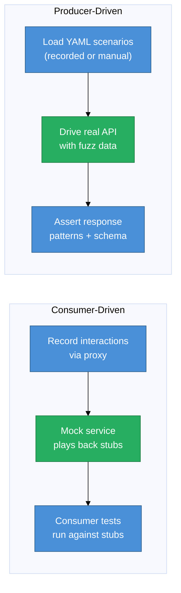

# Contract Testing Guide

api-mock-service supports both consumer-driven and producer-driven contract testing patterns. It records real interactions, plays them back as stubs for consumers, and drives real APIs with generated data to verify producer behavior — all from the same YAML scenario files.

## Overview



## Consumer-Driven Contract Testing

### Step 1: Record the contract

Run the mock service and route client traffic through port 8081:

```bash
export http_proxy="http://localhost:8081"
export https_proxy="http://localhost:8081"

curl -X POST https://jsonplaceholder.typicode.com/todos \
  -d '{"userId": 1, "id": 1, "title": "buy milk", "completed": false}'
```

This auto-generates a YAML scenario with:
- Exact request shape captured
- Regex-based `assert_contents_pattern` generated from response body types
- Response body stored for playback

### Step 2: Verify assertions and customize

The recorded scenario's `assert_contents_pattern` uses type tokens:
- `__string__<regex>` — asserts field is a string matching the regex
- `__number__<regex>` — asserts field is a number
- `__boolean__(true|false)` — asserts field is a boolean

Edit the scenario to tighten or relax assertions, then upload:

```bash
curl -H "Content-Type: application/yaml" \
  --data-binary @my-contract.yaml \
  http://localhost:8080/_scenarios
```

### Step 3: Run consumer tests against the mock

Consumer tests point at `localhost:8080` instead of the real API. The mock service validates requests against `assert_headers_pattern`/`assert_contents_pattern` and returns the recorded response.

## Producer-Driven Contract Testing

The producer executor loads scenarios, generates random request data from the constraints, sends real HTTP requests to the target API, and validates the responses.

### By Group (HTTP)

```bash
curl -X POST http://localhost:8080/_contracts/todos \
  -H "Content-Type: application/json" \
  -d '{
    "base_url": "https://jsonplaceholder.typicode.com",
    "execution_times": 5,
    "verbose": false
  }'
```

### By Specific Scenario (HTTP)

```bash
curl -X POST http://localhost:8080/_contracts/POST/post-todo/todos \
  -d '{"base_url": "https://jsonplaceholder.typicode.com"}'
```

### By History (HTTP)

```bash
curl -X POST http://localhost:8080/_contracts/history/todos \
  -d '{"base_url": "https://jsonplaceholder.typicode.com", "execution_times": 2}'
```

### CLI

```bash
api-mock-service producer-contract \
  --group todos \
  --base_url https://jsonplaceholder.typicode.com \
  --times 10
```

### Response Format

```json
{
  "results": {
    "post-todo_0": {"id": 201},
    "todo-get_0":  {"id": 2, "userId": 15}
  },
  "errors": {},
  "succeeded": 2,
  "failed": 0,
  "mismatched": 0
}
```

## Assertions in Scenarios

### Status Code Assertion

```yaml
response:
  status_code: 201
```

### Body Pattern Matching (flat keys)

```yaml
response:
  assert_contents_pattern: >
    {"id":"(__number__[+-]?[0-9]{1,10})",
     "title":"(__string__\\w+)",
     "completed":"(__boolean__(false|true))"}
```

### JSONPath Assertions (Plan A)

Use `$.` prefix or dot-path notation to match nested fields:

```yaml
response:
  assert_contents_pattern: >
    {"$.order.id":"(__number__\\d+)",
     "$.user.email":"(__string__\\w+@\\w+\\.\\w+)",
     "$.items[0].price":"(__number__[0-9]+\\.?[0-9]*)"}
```

JSONPath expressions are automatically detected when a key:
- Starts with `$.` — e.g., `$.user.role`
- Contains `[n]` array indexing — e.g., `items[0].name`

Backward compatible: existing flat-key patterns continue to work unchanged.

### Predicate Assertions

```yaml
response:
  assertions:
    - NumPropertyGE contents.id 0          # id >= 0
    - PropertyContains contents.title test  # title contains "test"
    - PropertyMatches headers.Pragma no-cache
    - ResponseTimeMillisLE 500              # response time <= 500ms
    - ResponseStatusMatches "(200|201)"     # status code matches regex
```

## Body→Template Injection (Plan A)

Request body JSON fields are automatically injected as template parameters — no manual configuration needed.

If a scenario has a request body like:
```json
{"customerId": "cust-42", "amount": 100}
```

The response template can reference them directly:
```yaml
response:
  contents: '{"orderId": {{RandInt}}, "customer": "{{.customerId}}", "total": {{.amount}}}'
```

Rules:
- Only top-level fields are injected (no deep merge — avoids key collisions)
- Path/query params win if there is a key conflict
- Works in both mock playback and producer contract execution

## OpenAPI Schema Validation (Plan A)

Validate that real API responses conform to the OpenAPI schema — missing required fields and type errors are surfaced automatically.

### Via CLI

```bash
api-mock-service producer-contract \
  --group my-api \
  --base_url https://api.example.com \
  --spec path/to/openapi.yaml
```

### Via HTTP request body

```json
{
  "base_url": "https://api.example.com",
  "execution_times": 3,
  "spec_content": "openapi: 3.0.3\ninfo:\n  title: My API\n..."
}
```

When a spec is provided, each response is validated via `openapi3filter`. Schema violations appear in the response:

```json
{
  "error_details": {
    "get-user_0": {
      "schemaViolations": [
        {"field": "email", "message": "value is required", "value": null},
        {"field": "age", "message": "value must be >= 0"}
      ]
    }
  }
}
```

Unknown routes (not in the spec) are skipped gracefully.

## Field-Level Diagnostics (Plan A)

Failed scenarios include a structured `error_details` map in the response alongside the flat `errors` string (which is preserved for backward compatibility):

```json
{
  "errors": {
    "get-user_0": "assertion failed: missing field id"
  },
  "error_details": {
    "get-user_0": {
      "summary": "assertion failed",
      "scenario": "get-user",
      "url": "https://api.example.com/users/42",
      "statusCode": 200,
      "expectedStatusCode": 201,
      "missingFields": ["id", "email"],
      "valueMismatches": {
        "status": {"expected": "active", "actual": "pending"}
      },
      "headerMismatches": {
        "Content-Type": {"expected": "application/json", "actual": "text/plain"}
      },
      "schemaViolations": []
    }
  }
}
```

## Coverage Reporting (Plan A)

Track which OpenAPI paths and methods were exercised during a contract run.

### Via CLI

```bash
api-mock-service producer-contract \
  --group my-api \
  --base_url https://api.example.com \
  --spec openapi.yaml \
  --track-coverage
```

The CLI prints a coverage table after execution:

```
COVERAGE REPORT
──────────────────────────────────────────────────────────────
Overall: 87.5%  (7/8 paths)

Uncovered paths:
  ✗ DELETE /users/:id

Method coverage:
  GET    100.0%
  POST   75.0%
  DELETE 0.0%
```

### Via HTTP

```json
{
  "base_url": "https://api.example.com",
  "track_coverage": true,
  "spec_content": "openapi: 3.0.3\n..."
}
```

Coverage is returned in the response:

```json
{
  "coverage": {
    "totalPaths": 8,
    "coveredPaths": 7,
    "coveragePercentage": 87.5,
    "uncoveredPaths": ["DELETE /users/:id"],
    "methodCoverage": {"GET": 100.0, "POST": 75.0, "DELETE": 0.0}
  }
}
```

## Mutation Testing (Plan A)

Mutation testing checks API robustness by sending systematically corrupted requests and verifying the API rejects them appropriately.

### Via CLI

```bash
api-mock-service producer-contract \
  --group my-api \
  --base_url https://api.example.com \
  --mutations
```

### Via HTTP

```bash
curl -X POST http://localhost:8080/_contracts/mutations/my-api \
  -d '{"base_url": "https://api.example.com", "execution_times": 1}'
```

Mutation variants generated per scenario:
- **Null mutations** — each field set to `null` (expects 422)
- **Combinatorial** — pairs of (field[i] boundary + field[j] null), capped at 10
- **Format boundary** — invalid dates, UUIDs, emails, URIs
- **Boundary values** — MinInt32 + empty string, MaxInt32 + 255-char string (both min and max)
- **Security injection** — SQLi, path traversal, LDAP injection, command injection, SSRF, XXE

For detail on mutation strategies, see [Fuzz & Property Testing](fuzz-property-testing.md).

## Chaining Scenarios

Define scenarios with `order` and `add_shared_variables` to pass data from one step to the next:

```yaml
# Step 1: Create a resource
method: POST
name: create-order
path: /orders
order: 0
group: order-flow
response:
  contents: '{"id": {{RandIntMinMax 100 999}}, "status": "created"}'
  add_shared_variables:
    - id         # capture "id" for the next step
  assertions:
    - NumPropertyGE contents.id 100

---
# Step 2: Fetch the created resource (uses {{.id}} from step 1)
method: GET
name: get-order
path: /orders/:id
order: 1
group: order-flow
response:
  contents: '{"id": {{.id}}, "status": "shipped"}'
  assertions:
    - NumPropertyGE contents.id 0
    - PropertyContains contents.status shipped
```

Run the chain:

```bash
curl -X POST http://localhost:8080/_contracts/order-flow \
  -d '{"base_url": "https://api.example.com", "execution_times": 3}'
```

## ProducerContractRequest Fields

| Field | Type | Default | Description |
|-------|------|---------|-------------|
| `base_url` | string | — | Target API base URL |
| `execution_times` | int | 5 | Number of runs per scenario |
| `verbose` | bool | false | Log request/response details |
| `track_coverage` | bool | false | Include coverage report (Plan A) |
| `run_mutations` | bool | false | Run mutation testing mode (Plan A) |
| `spec_content` | string | — | Inline OpenAPI YAML/JSON for schema validation (Plan A) |

## Related Docs

- [API Reference](api-reference.md) — HTTP endpoint details
- [CLI Reference](cli-reference.md) — all command flags
- [Fuzz & Property Testing](fuzz-property-testing.md) — mutation strategies in depth
- [OpenAPI Guide](openapi-guide.md) — spec import and discriminator support
- [Mock Guide](mock-guide.md) — recording and playback
