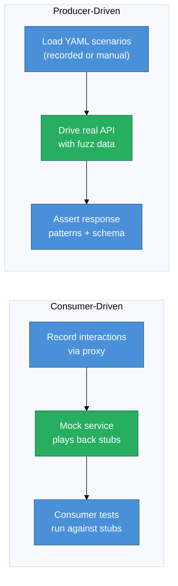

# Contract Testing Guide

api-mock-service supports both consumer-driven and producer-driven contract testing patterns. It records real interactions, plays them back as stubs for consumers, and drives real APIs with generated data to verify producer behavior — all from the same YAML scenario files.

## Overview


```mermaid
%%{init: {"theme": "base"}}%%
graph LR
    subgraph Consumer-Driven
        C1["Record interactions\nvia proxy"]:::blue
        C2["Mock service\nplays back stubs"]:::green
        C3["Consumer tests\nrun against stubs"]:::blue
        C1 --> C2 --> C3
    end
    subgraph Producer-Driven
        P1["Load YAML scenarios\n(recorded or manual)"]:::blue
        P2["Drive real API\nwith fuzz data"]:::green
        P3["Assert response\npatterns + schema"]:::blue
        P1 --> P2 --> P3
    end
    classDef blue fill:#4A90D9,color:#fff,stroke:#2C5F8A
    classDef green fill:#27AE60,color:#fff,stroke:#1A7A42
```

## Consumer-Driven Contract Testing

### Step 1: Record the contract

Run the mock service and route client traffic through port 8081:

```bash
export http_proxy="http://localhost:8081"
export https_proxy="http://localhost:8081"

curl -X POST https://jsonplaceholder.typicode.com/todos \
  -d '{"userId": 1, "id": 1, "title": "buy milk", "completed": false}'
```

This auto-generates a YAML scenario with:
- Exact request shape captured
- Regex-based `assert_contents_pattern` generated from response body types
- Response body stored for playback

### Step 2: Verify assertions and customize

The recorded scenario's `assert_contents_pattern` uses type tokens:
- `__string__<regex>` — asserts field is a string matching the regex
- `__number__<regex>` — asserts field is a number
- `__boolean__(true|false)` — asserts field is a boolean

Edit the scenario to tighten or relax assertions, then upload:

```bash
curl -H "Content-Type: application/yaml" \
  --data-binary @my-contract.yaml \
  http://localhost:8080/_scenarios
```

### Step 3: Run consumer tests against the mock

Consumer tests point at `localhost:8080` instead of the real API. The mock service validates requests against `assert_headers_pattern`/`assert_contents_pattern` and returns the recorded response.

## Producer-Driven Contract Testing

The producer executor loads scenarios, generates random request data from the constraints, sends real HTTP requests to the target API, and validates the responses.

### By Group (HTTP)

```bash
curl -X POST http://localhost:8080/_contracts/todos \
  -H "Content-Type: application/json" \
  -d '{
    "base_url": "https://jsonplaceholder.typicode.com",
    "execution_times": 5,
    "verbose": false
  }'
```

### By Specific Scenario (HTTP)

```bash
curl -X POST http://localhost:8080/_contracts/POST/post-todo/todos \
  -d '{"base_url": "https://jsonplaceholder.typicode.com"}'
```

### By History (HTTP)

```bash
curl -X POST http://localhost:8080/_contracts/history/todos \
  -d '{"base_url": "https://jsonplaceholder.typicode.com", "execution_times": 2}'
```

### CLI

```bash
api-mock-service producer-contract \
  --group todos \
  --base_url https://jsonplaceholder.typicode.com \
  --times 10
```

### Response Format

```json
{
  "results": {
    "post-todo_0": {"id": 201},
    "todo-get_0":  {"id": 2, "userId": 15}
  },
  "errors": {},
  "succeeded": 2,
  "failed": 0,
  "mismatched": 0
}
```

## Assertions in Scenarios

### Status Code Assertion

```yaml
response:
  status_code: 201
```

### Body Pattern Matching (flat keys)

```yaml
response:
  assert_contents_pattern: >
    {"id":"(__number__[+-]?[0-9]{1,10})",
     "title":"(__string__\\w+)",
     "completed":"(__boolean__(false|true))"}
```

### JSONPath Assertions

Use `$.` prefix or dot-path notation to match nested fields:

```yaml
response:
  assert_contents_pattern: >
    {"$.order.id":"(__number__\\d+)",
     "$.user.email":"(__string__\\w+@\\w+\\.\\w+)",
     "$.items[0].price":"(__number__[0-9]+\\.?[0-9]*)"}
```

JSONPath expressions are automatically detected when a key:
- Starts with `$.` — e.g., `$.user.role`
- Contains `[n]` array indexing — e.g., `items[0].name`

Backward compatible: existing flat-key patterns continue to work unchanged.

### Predicate Assertions

```yaml
response:
  assertions:
    - NumPropertyGE contents.id 0          # id >= 0
    - PropertyContains contents.title test  # title contains "test"
    - PropertyMatches headers.Pragma no-cache
    - ResponseTimeMillisLE 500              # response time <= 500ms
    - ResponseStatusMatches "(200|201)"     # status code matches regex
```

## Body→Template Injection

Request body JSON fields are automatically injected as template parameters — no manual configuration needed.

If a scenario has a request body like:
```json
{"customerId": "cust-42", "amount": 100}
```

The response template can reference them directly:
```yaml
response:
  contents: '{"orderId": {{RandInt}}, "customer": "{{.customerId}}", "total": {{.amount}}}'
```

Rules:
- Only top-level fields are injected (no deep merge — avoids key collisions)
- Path/query params win if there is a key conflict
- Works in both mock playback and producer contract execution

## OpenAPI Schema Validation

Validate that real API responses conform to the OpenAPI schema — missing required fields and type errors are surfaced automatically.

### Via CLI

```bash
api-mock-service producer-contract \
  --group my-api \
  --base_url https://api.example.com \
  --spec path/to/openapi.yaml
```

### Via HTTP request body

```json
{
  "base_url": "https://api.example.com",
  "execution_times": 3,
  "spec_content": "openapi: 3.0.3\ninfo:\n  title: My API\n..."
}
```

When a spec is provided, each response is validated via `openapi3filter`. Schema violations appear in the response:

```json
{
  "error_details": {
    "get-user_0": {
      "schemaViolations": [
        {"field": "email", "message": "value is required", "value": null},
        {"field": "age", "message": "value must be >= 0"}
      ]
    }
  }
}
```

Unknown routes (not in the spec) are skipped gracefully.

## Field-Level Diagnostics

Failed scenarios include a structured `error_details` map in the response alongside the flat `errors` string (which is preserved for backward compatibility):

```json
{
  "errors": {
    "get-user_0": "assertion failed: missing field id"
  },
  "error_details": {
    "get-user_0": {
      "summary": "assertion failed",
      "scenario": "get-user",
      "url": "https://api.example.com/users/42",
      "statusCode": 200,
      "expectedStatusCode": 201,
      "missingFields": ["id", "email"],
      "valueMismatches": {
        "status": {"expected": "active", "actual": "pending"}
      },
      "headerMismatches": {
        "Content-Type": {"expected": "application/json", "actual": "text/plain"}
      },
      "schemaViolations": []
    }
  }
}
```

## Coverage Reporting

Track which OpenAPI paths and methods were exercised during a contract run.

### Via CLI

```bash
api-mock-service producer-contract \
  --group my-api \
  --base_url https://api.example.com \
  --spec openapi.yaml \
  --track-coverage
```

The CLI prints a coverage table after execution:

```
COVERAGE REPORT
──────────────────────────────────────────────────────────────
Overall: 87.5%  (7/8 paths)

Uncovered paths:
  ✗ DELETE /users/:id

Method coverage:
  GET    100.0%
  POST   75.0%
  DELETE 0.0%
```

### Via HTTP

```json
{
  "base_url": "https://api.example.com",
  "track_coverage": true,
  "spec_content": "openapi: 3.0.3\n..."
}
```

Coverage is returned in the response:

```json
{
  "coverage": {
    "totalPaths": 8,
    "coveredPaths": 7,
    "coveragePercentage": 87.5,
    "uncoveredPaths": ["DELETE /users/:id"],
    "methodCoverage": {"GET": 100.0, "POST": 75.0, "DELETE": 0.0}
  }
}
```

## Mutation Testing

Mutation testing checks API robustness by sending systematically corrupted requests and verifying the API rejects them appropriately.

### Via CLI

```bash
api-mock-service producer-contract \
  --group my-api \
  --base_url https://api.example.com \
  --mutations
```

### Via HTTP

```bash
curl -X POST http://localhost:8080/_contracts/mutations/my-api \
  -H "Content-Type: application/json" \
  -d '{"base_url": "https://api.example.com", "mutation_rounds": 3, "timing_threshold_multiplier": 3.0}'
```

### Per-Scenario Mutation Strategies (7 types)

| Strategy | What it does | Expected status |
|----------|-------------|-----------------|
| **Null fields** | Each field set to `null` one at a time | 422 |
| **Combinatorial** | Pairs of (field[i] boundary + field[j] null), capped at 10 | 422 |
| **Format boundary** | Invalid dates, UUIDs, emails, URIs | 400/422 |
| **Boundary values** | MinInt32 + empty string, MaxInt32 + 255-char string | 400/422 |
| **Security injection** | Grammar-based payloads across 8 vulnerability classes (SQLi, XSS, path traversal, SSTI, cmd injection, NoSQL, LDAP, XXE) | 400 |
| **Missing fields** | Remove optional fields to test incomplete requests | 400/422 |
| **Malformed data** | Overflow strings (10,000 chars), special characters (Unicode, null bytes, control chars) | 400/422 |

Security injection payloads are generated from grammars with randomized variants — each `mutation_rounds` cycle produces different payloads, increasing coverage. Set `mutation_rounds: 3` or higher for thorough security testing.

### Sequence-Level Mutation Strategies (4 types)

When a group has multiple scenarios, these strategies test operation ordering:

| Strategy | What it does |
|----------|-------------|
| **Reversed** | Execute scenarios in reverse order |
| **Skip step** | Remove each scenario one at a time |
| **Duplicate step** | Repeat each scenario (tests idempotency) |
| **Method swap** | PUT↔PATCH, GET→DELETE |

### Response Analysis

After each mutation, responses are automatically analyzed for:
- **Database error signatures** (MySQL, PostgreSQL, SQLite, MSSQL, Oracle, MongoDB, LDAP)
- **Reflected payloads** (XSS, SSTI reflected back unescaped)
- **Blind injection** (response time > `timing_threshold_multiplier` × baseline with timing payload)
- **Information disclosure** (stack traces, file paths, version strings)
- **Unexpected 500** (unhandled input vs. proper 400/422 rejection)

Findings are classified by CWE and aggregated into a `securitySummary`. Failures are deduplicated and clustered by (status code, error category, endpoint, response hash).

For detail on mutation strategies, see [Fuzz & Property Testing](fuzz-property-testing.md).

## Chaining Scenarios

Define scenarios with `order` and `add_shared_variables` to pass data from one step to the next:

```yaml
# Step 1: Create a resource
method: POST
name: create-order
path: /orders
order: 0
group: order-flow
response:
  contents: '{"id": {{RandIntMinMax 100 999}}, "status": "created"}'
  add_shared_variables:
    - id         # capture "id" for the next step
  assertions:
    - NumPropertyGE contents.id 100

---
# Step 2: Fetch the created resource (uses {{.id}} from step 1)
method: GET
name: get-order
path: /orders/:id
order: 1
group: order-flow
response:
  contents: '{"id": {{.id}}, "status": "shipped"}'
  assertions:
    - NumPropertyGE contents.id 0
    - PropertyContains contents.status shipped
```

Run the chain:

```bash
curl -X POST http://localhost:8080/_contracts/order-flow \
  -d '{"base_url": "https://api.example.com", "execution_times": 3}'
```

## ProducerContractRequest Fields

| Field | Type | Default | Description |
|-------|------|---------|-------------|
| `base_url` | string | — | Target API base URL |
| `execution_times` | int | 5 | Number of runs per scenario |
| `verbose` | bool | false | Log request/response details |
| `track_coverage` | bool | false | Include coverage report (requires `spec_content`) |
| `run_mutations` | bool | false | Run mutation testing mode |
| `spec_content` | string | — | Inline OpenAPI YAML/JSON for schema validation |
| `dry_run` | bool | false | List scenarios that would run without executing them |
| `match_response_code` | int | 0 | Override expected status code for all scenarios (0 = use scenario default) |
| `record_results` | bool | false | Store contract validation results in history |
| `timing_threshold_multiplier` | float64 | 3.0 | Multiplier over baseline response time to flag blind injection (e.g., 3.0 = 3x slower triggers finding) |
| `mutation_rounds` | int | 1 | Number of complete mutation rounds (higher = more payload diversity) |

---

## Stateful Scenario Testing

Test multi-step API workflows where each request depends on the previous response. Use the `state_machine` field in a scenario YAML to define state transitions.

### How it works

1. Include `X-Session-ID` header in each request to track session state
2. The mock service stores session state in memory
3. After each response, the state machine transitions to the next state
4. Optionally extract values from the response body using JSONPath

### Example: CREATE → READ → DELETE

```yaml
# Step 1: Create order
name: create-order
method: POST
path: /orders
group: order-workflow
response:
  status: 201
  contents: '{"orderId": "{{uuid}}", "status": "pending"}'
state_machine:
  initial_state: ""
  transitions:
    - from: ""
      to: "created"
      on_method: POST
      on_status: 201
      extract_key: "$.orderId"   # saves response orderId into session store
```

```yaml
# Step 2: Read order (only matches when session state is "created")
name: get-order
method: GET
path: /orders/:id
group: order-workflow
state_machine:
  initial_state: "created"
  transitions:
    - from: "created"
      to: "viewed"
      on_method: GET
      on_status: 200
```

### Session Header

All requests must include the session identifier:

```
X-Session-ID: my-unique-session-123
```

Values extracted via `extract_key` are stored in the session under the field name derived from the JSONPath. For example, `extract_key: "$.orderId"` stores the value under the key `orderId`, which becomes available as `{{.orderId}}` in subsequent scenario response templates within the same session. If the JSONPath does not match (field absent from response), the extraction is silently skipped.

---

## Spec Version Diff / Breaking Change Detection

Compare two OpenAPI specs to identify breaking changes before deploying. Use this in CI to prevent accidental client-breaking API changes.

### HTTP Endpoint

```bash
POST /_oapi/diff
Content-Type: application/json

{
  "base": "<base spec YAML or JSON>",
  "head": "<head spec YAML or JSON>"
}
```

Returns HTTP **409 Conflict** when breaking changes are detected (CI-friendly exit signal).

Response:
```json
{
  "breakingChanges": [
    {
      "path": "/users",
      "method": "GET",
      "field": "id",
      "changeType": "type-change",
      "before": "integer",
      "after": "string",
      "severity": "breaking"
    }
  ],
  "nonBreakingChanges": [...],
  "addedPaths": ["/products"],
  "removedPaths": []
}
```

### Breaking Change Rules

| Change | Severity |
|--------|----------|
| Removed path or method | **Breaking** |
| Existing optional param promoted to required | **Breaking** |
| New required request parameter | **Breaking** |
| Field type change | **Breaking** |
| Response field removed | **Breaking** |
| Format change on existing field | **Breaking** |
| Enum value removed (narrowed) | **Breaking** |
| Added path or method | Non-breaking |
| New optional parameter | Non-breaking |
| Response field added | Non-breaking |
| Enum value added (widened) | Non-breaking |

### CLI Command

```bash
api-mock-service compare-specs \
  --base v1.yaml \
  --head v2.yaml \
  --fail-on-breaking   # exit code 2 when breaking changes found (CI gating)
  --json               # JSON output instead of table
```

### CI Integration

```yaml
# GitHub Actions example
- name: Check for breaking API changes
  run: |
    api-mock-service compare-specs \
      --base api/v1.yaml \
      --head api/v2.yaml \
      --fail-on-breaking
```

---

## Fuzz Shrinking

When a mutation test finds a failing input, shrinking reduces it to the minimal payload that still triggers the failure. This saves debugging time — instead of a 20-field payload where 1 field is the culprit, you get the exact minimal reproducing case.

### Enable via CLI

```bash
api-mock-service producer-contract \
  --group my-service \
  --base_url https://api.example.com \
  --mutations \
  --shrink   # enable post-failure shrinking
```

### Output Example

```
SHRINK ANALYSIS
Shrinking POST /orders-201 ...
  ✓ reduced in 18 attempts
  Minimal body: {"price":-9223372036854775808}
```

### Strategies

Shrinking tries four strategies in order:
1. **Field removal** — removes fields one-by-one; keeps removal if it still fails (delta debugging)
2. **String shortening** — binary search to find minimal length that triggers failure
3. **Array shrinking** — removes array elements one-by-one
4. **Numeric reduction** — exponential backoff from boundary values (MaxInt → 0)

---

## Dry Run Mode

List scenarios that would be executed without making any API calls:

```bash
api-mock-service producer-contract \
  --group my-service \
  --base_url https://api.example.com \
  --dry-run
```

Or via HTTP:

```bash
curl -X POST http://localhost:8080/_contracts/my-service \
  -d '{"base_url": "https://api.example.com", "dry_run": true}'
```

---

## Coverage Endpoint

After running producer contracts with `track_coverage: true`, retrieve the coverage report any time:

```bash
GET /_coverage/:group
```

```bash
curl http://localhost:8080/_coverage/my-service
```

Returns the last coverage summary for the group, or a 200 with an informational message if no coverage data is available yet.

## HAR / Postman Import with Auto-Assertions

When you import traffic from a HAR file or Postman collection, response bodies are **automatically analyzed to generate `assert_contents_pattern` assertions** — no manual work required.

```bash
# Import from HAR (Chrome DevTools, proxy recording, etc.)
curl -X POST http://localhost:8080/_history/har \
  --data-binary @recording.har

# Import from Postman collection
curl -X POST http://localhost:8080/_history/postman \
  -H "Content-Type: */*" \
  --data-binary @collection.json
```

Given a recorded response body `{"id":42,"email":"user@test.com","active":true}`, the import creates:

```yaml
response:
  assert_contents_pattern: >
    {"id": "__number__\\d+",
     "email": "__string__\\S+",
     "active": "__boolean__(true|false)"}
```

These auto-generated assertions become the baseline for future contract runs — any API change that alters the response shape is caught immediately. See [Fuzz & Property Testing](fuzz-property-testing.md#har--postman-import-with-auto-assertions) for more detail.

---

## Security Findings in Mutation Results

Mutation testing automatically scans API responses for injection vulnerabilities. When a security payload (SQLi, XSS, SSTI, etc.) triggers an error signature or is reflected back unescaped, an `InjectionFinding` is attached to the mutation result.

Findings appear in `error_details[key].injectionFindings` and are aggregated into a top-level `securitySummary` with OWASP classification. See [Fuzz & Property Testing — Injection Detection](fuzz-property-testing.md#injection-detection) for the full detection catalog.

### Example: Security-Aware Mutation Run

```bash
curl -X POST http://localhost:8080/_contracts/mutations/my-api \
  -d '{"base_url": "https://api.example.com", "timing_threshold_multiplier": 3.0}'
```

Response includes:
```json
{
  "succeeded": 42,
  "failed": 8,
  "securitySummary": {
    "totalFindings": 5,
    "bySeverity": {"critical": 2, "high": 2, "info": 1},
    "byCategory": {"CWE-89": 2, "CWE-79": 2, "CWE-200": 1},
    "passedChecks": ["ssti", "cmd-injection", "nosqli", "ldapi", "xxe", "path-traversal"]
  },
  "failureClusters": [
    {
      "key": {"statusCode": 500, "errorCategory": "injection", "endpoint": "POST /users"},
      "count": 3,
      "representative": "create-user-sec-sqli-name_0",
      "severity": "critical"
    }
  ]
}
```

---

## Automatic Dependency Discovery

When you upload an OpenAPI spec, api-mock-service can automatically discover data-flow dependencies between operations. For example, `POST /pets` produces an `id` that `GET /pets/{petId}` consumes.

The dependency graph uses confidence-weighted name matching:

| Match Type | Confidence | Example |
|-----------|-----------|---------|
| Exact (after normalizing case/separators) | 1.0 | Response `userId` → request `user_id` |
| Singular/plural | 0.9 | Response `user` → request `users` |
| ID pattern + same resource path | 0.8 | Response `id` from `POST /pets` → `{petId}` in `GET /pets/{petId}` |
| Generic ID | 0.7 | Response `id` → request field containing `id` |

Operations are topologically sorted so producers execute before consumers.

---

## Testing Operation Ordering (Sequence Mutations)

Sequence-level mutations test whether your API correctly handles unexpected operation orderings:

```bash
curl -X POST http://localhost:8080/_contracts/mutations/my-api \
  -d '{"base_url": "https://api.example.com"}'
```

Four strategies are applied to each scenario group:

- **Reversed**: Execute scenarios in reverse order (tests order dependency)
- **Skip step**: Remove each scenario one at a time (tests missing prerequisites)
- **Duplicate step**: Repeat each scenario (tests idempotency)
- **Method swap**: Alternate HTTP methods — PUT↔PATCH, GET→DELETE (tests method confusion)

---

## CI/CD Integration

Export mutation test results in JUnit XML or JSON format for integration with CI/CD pipelines.

### JUnit XML Report

```bash
# Run mutations first
curl -X POST http://localhost:8080/_contracts/mutations/my-api \
  -d '{"base_url": "https://api.example.com"}'

# Then fetch JUnit XML
curl http://localhost:8080/_reports/my-api/junit -o results.xml
```

The JUnit XML includes:
- Test suite = scenario group
- Test case = individual scenario execution
- Failure = contract validation error with diff report
- Properties = coverage %, injection finding count, failure cluster count

### JSON Summary Report

```bash
curl http://localhost:8080/_reports/my-api/summary
```

Returns:
```json
{
  "group": "my-api",
  "succeeded": 42,
  "failed": 8,
  "total": 50,
  "passRate": 84.0,
  "securitySummary": {"totalFindings": 5},
  "failureClusters": [{"count": 3}],
  "topErrors": ["status 500 didn't match expected value 200"]
}
```

### GitHub Actions Example

```yaml
- name: Run mutation tests
  run: |
    curl -X POST http://localhost:8080/_contracts/mutations/my-api \
      -d '{"base_url": "http://localhost:3000"}'
    curl http://localhost:8080/_reports/my-api/junit -o test-results.xml

- name: Publish test results
  uses: dorny/test-reporter@v1
  with:
    name: API Mutation Tests
    path: test-results.xml
    reporter: java-junit
```

---

## OWASP Classification

All injection findings are classified with CWE identifiers and mapped to OWASP Web Security Testing Guide (WSTG) test IDs:

| CWE | OWASP Test ID | Category |
|-----|---------------|----------|
| CWE-89 | WSTG-INPV-05 | SQL Injection |
| CWE-79 | WSTG-INPV-01 | Cross-Site Scripting |
| CWE-78 | WSTG-INPV-12 | Command Injection |
| CWE-22 | WSTG-ATHZ-01 | Path Traversal |
| CWE-90 | WSTG-INPV-06 | LDAP Injection |
| CWE-611 | WSTG-INPV-07 | XML External Entity |
| CWE-1336 | WSTG-INPV-18 | Server-Side Template Injection |
| CWE-943 | WSTG-INPV-05 | NoSQL Injection |

The `securitySummary.passedChecks` field lists vulnerability classes where no findings were detected — confirming your API handles those attack vectors safely.

---

## Related Docs

- [API Reference](api-reference.md) — HTTP endpoint details, report export endpoints
- [CLI Reference](cli-reference.md) — all command flags
- [Fuzz & Property Testing](fuzz-property-testing.md) — mutation strategies, injection detection, failure dedup
- [OpenAPI Guide](openapi-guide.md) — spec import, discriminator support, auto-discovered chains
- [Mock Guide](mock-guide.md) — recording and playback
