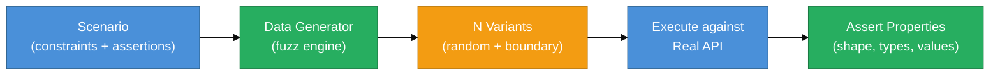
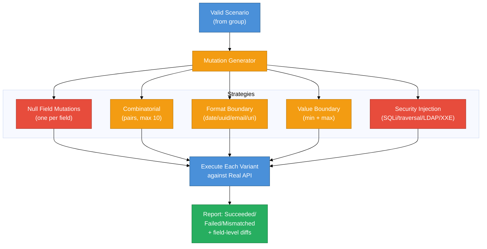

# Fuzz & Property-Based Testing Guide

Property-based testing shifts focus from "does this specific input produce the right output?" to "does the API satisfy these properties for *all* inputs in this space?" api-mock-service generates test input automatically from constraints defined in scenario files or OpenAPI specs, shrinking your test suite while increasing coverage.

## What Property-Based Testing Means Here

Traditional testing: write 5 hand-crafted request bodies.

Property-based testing: declare *what* the inputs should look like (regex, type, range) and let the framework generate hundreds of variants automatically, including boundary cases you wouldn't think to write by hand.



## Data Template Request

Every contract execution takes a `DataTemplateRequest` that controls how many variants are generated:

```go
// Defaults used in HTTP and CLI execution
fuzz.NewDataTemplateRequest(false, 1, 1)
//                          seeded, minCount, maxCount
```

- `seeded: false` — random data on each run
- `seeded: true` — deterministic data (same seed = same test data every time)
- `minCount / maxCount` — range of values to generate per template expression

## Assertion Types

Property assertions in `assert_contents_pattern` use type tokens:

| Token | Meaning | Example |
|-------|---------|---------|
| `__string__<regex>` | Field is a string matching regex | `__string__\\w+` |
| `__number__<regex>` | Field is a number matching regex | `__number__[0-9]{1,10}` |
| `__boolean__(true\|false)` | Field is a boolean | `__boolean__(false\|true)` |
| `(__array__N)` | Field is an array of length N | `__array__5` |

Example pattern:
```yaml
assert_contents_pattern: >
  {"id":"(__number__[+-]?[0-9]{1,10})",
   "title":"(__string__\\w+)",
   "completed":"(__boolean__(false|true))"}
```

### JSONPath Assertions (Plan A)

Nested fields can be asserted using `$.` prefix or dot-path notation:

```yaml
assert_contents_pattern: >
  {"$.user.email":"(__string__\\w+@\\w+\\.\\w+)",
   "$.order.items[0].price":"(__number__[0-9]+\\.?[0-9]*)",
   "$.meta.count":"(__number__\\d+)"}
```

Mixed flat and JSONPath keys in the same pattern are fully supported and backward compatible.

### Predicate Assertions

In the `assertions` list:

```yaml
assertions:
  - NumPropertyGE contents.id 0         # id >= 0
  - NumPropertyLE contents.age 120      # age <= 120
  - NumPropertyEQ contents.version 2    # version == 2
  - PropertyContains contents.title illo
  - PropertyEquals contents.status active
  - PropertyMatches headers.Content-Type application/json
  - PropertyLenGE contents.items 1      # items array length >= 1
  - ResponseTimeMillisLE 300            # response time <= 300ms
  - ResponseStatusMatches "(200|201)"   # status code regex
```

## OpenAPI-Driven Property Assertions

When you upload an OpenAPI spec, the parser auto-generates `assert_contents_pattern` from each schema field's type, format, and constraints:

- `string` + `pattern: "^AC[0-9a-fA-F]{32}$"` → `__string__^AC[0-9a-fA-F]{32}$`
- `integer` → `__number__[+-]?[0-9]{1,10}`
- `string` + `format: date-time` → asserts ISO 8601 datetime
- `string` + `format: uri` → asserts URL shape

Uploaded spec scenarios come pre-loaded with assertions requiring zero manual work.

## eCommerce Example

A complete property-based test for an order API:

```yaml
method: POST
name: create-order
path: /orders
group: ecommerce
request:
  assert_headers_pattern:
    Content-Type: application/json
    Authorization: "Bearer [A-Za-z0-9]{20,}"
  assert_contents_pattern: >
    {"customerId":"(__string__cust-[0-9]{4,8})",
     "items[0].productId":"(__string__prod-[0-9]{3,6})",
     "items[0].quantity":"(__number__[1-9][0-9]?)",
     "$.payment.method":"(__string__(credit|debit|paypal))"}
response:
  status_code: 201
  assert_contents_pattern: >
    {"orderId":"(__string__ord-[0-9]{6,10})",
     "status":"(__string__(pending|confirmed))",
     "$.pricing.total":"(__number__[0-9]+\\.?[0-9]*)"}
  assertions:
    - NumPropertyGE contents.pricing.total 0
    - ResponseTimeMillisLE 500
```

Run 20 variants against the real API:

```bash
curl -X POST http://localhost:8080/_contracts/ecommerce \
  -d '{"base_url": "https://api.example.com", "execution_times": 20}'
```

## Mutation Testing (Plan A)

Mutation testing goes further than property testing: it deliberately corrupts requests and verifies the API *rejects* them. A good API should return `4xx` for malformed input; an API that accepts every mutation has dangerous gaps in input validation.



### Running Mutations

```bash
# CLI
api-mock-service producer-contract \
  --group my-api \
  --base_url https://api.example.com \
  --mutations

# HTTP
curl -X POST http://localhost:8080/_contracts/mutations/my-api \
  -d '{"base_url": "https://api.example.com"}'
```

### Mutation Strategy Details

#### Null Field Mutations

For each top-level field in the request body, generates one mutation with that field set to `null`. The expected API response is `422 Unprocessable Entity` or `400 Bad Request`.

```json
// Original: {"name": "Alice", "email": "alice@example.com", "age": 30}
// Null mutation 1: {"name": null, "email": "alice@example.com", "age": 30}
// Null mutation 2: {"name": "Alice", "email": null, "age": 30}
// Null mutation 3: {"name": "Alice", "email": "alice@example.com", "age": null}
```

#### Combinatorial Mutations

Pairs of (field[i] at boundary value, field[j] set to null) for i ≠ j — tests whether the API correctly validates multiple simultaneous constraints. Capped at 10 pairs to keep execution time bounded.

#### Format-Specific Boundary Mutations

Detects field types by name heuristic or `assert_contents_pattern` tokens and injects invalid format values:

| Field type | Invalid values injected |
|------------|------------------------|
| Date fields (`*Date`, `*At`, `*Time`) | `"not-a-date"`, `"2024-02-30"` |
| UUID fields (`*Id`, `*Uuid`) | `"not-a-uuid"`, `"00000000-0000-0000-0000-000000000000"` |
| Email fields (`*Email`) | `"@nodomain"`, `"no-at-sign"` |
| URI fields (`*Url`, `*Uri`) | `"://no-scheme"`, `"../relative/path"` |

#### Boundary Value Mutations

Generates **two** variants per scenario (instead of one):
- **Min**: all numeric fields → `MinInt32` (-2147483648), all string fields → `""` (empty)
- **Max**: all numeric fields → `MaxInt32` (2147483647), all string fields → 255-character string

Both test that the API handles extreme inputs without panicking.

#### Security Injection Mutations

Each string field gets injected with security payloads to verify the API sanitizes input:

| Category | Payloads |
|----------|---------|
| SQL injection | `' OR 1=1; --`, `1; DROP TABLE users; --` |
| Path traversal | `../../etc/passwd` |
| LDAP injection | `*(|(uid=*))` |
| Command injection | `; cat /etc/passwd`, `\| whoami` |
| SSRF | `http://169.254.169.254/latest/meta-data/` |
| XXE | `<?xml version='1.0'?><!DOCTYPE x [<!ENTITY xxe SYSTEM 'file:///etc/passwd'>]>` |
| XSS | `<script>alert(1)</script>` |

A robust API should return `400` or `422` for all of these. If the API returns `200` with the injection payload reflected in the response, the mutation test fails — surfacing a real security gap.

### Mutation Results

```json
{
  "results": {},
  "errors": {
    "create-user-null-email_0": "status mismatch: got 200, expected 422"
  },
  "error_details": {
    "create-user-null-email_0": {
      "summary": "status mismatch",
      "statusCode": 200,
      "expectedStatusCode": 422
    }
  },
  "succeeded": 18,
  "failed": 1,
  "mismatched": 0
}
```

## Fuzz Data Functions in Templates

The same functions used in mock templates are available as fuzz data sources. See the [Mock Guide — Template Function Reference](mock-guide.md#template-function-reference) for the complete list.

Quick examples for property test scenarios:

```yaml
request:
  contents: >
    {"userId": "{{RandRegex `user-[0-9]{4}`}}",
     "amount": {{RandIntMinMax 1 100000}},
     "email": "{{RandEmail}}",
     "createdAt": "{{Time}}"}
```

## Related Docs

- [Contract Testing](contract-testing.md) — running mutations via CLI and HTTP, coverage reports
- [Mock Guide](mock-guide.md) — template functions reference
- [OpenAPI Guide](openapi-guide.md) — auto-generating property assertions from specs
- [API Reference](api-reference.md) — mutations endpoint details
- [CLI Reference](cli-reference.md) — `--mutations` and related flags
