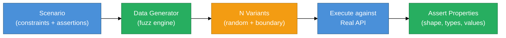
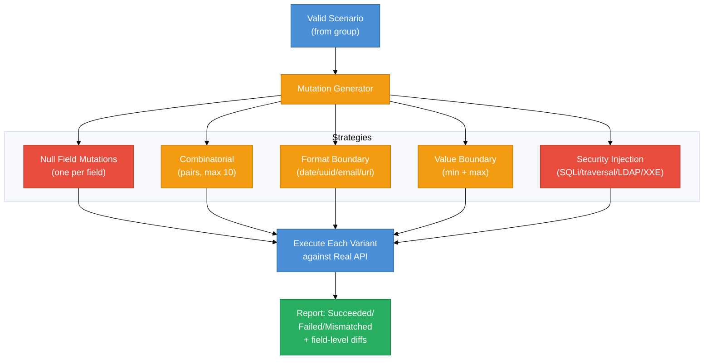

# Fuzz & Property-Based Testing Guide

Property-based testing shifts focus from "does this specific input produce the right output?" to "does the API satisfy these properties for *all* inputs in this space?" api-mock-service generates test input automatically from constraints defined in scenario files or OpenAPI specs, shrinking your test suite while increasing coverage.

## What Property-Based Testing Means Here

Traditional testing: write 5 hand-crafted request bodies.

Property-based testing: declare *what* the inputs should look like (regex, type, range) and let the framework generate hundreds of variants automatically, including boundary cases you wouldn't think to write by hand.


```mermaid
%%{init: {"theme": "base"}}%%
flowchart LR
    S["Scenario\n(constraints + assertions)"]:::blue
    G["Data Generator\n(fuzz engine)"]:::green
    V["N Variants\n(random + boundary)"]:::amber
    E["Execute against\nReal API"]:::blue
    R["Assert Properties\n(shape, types, values)"]:::green

    S --> G --> V --> E --> R

    classDef blue fill:#4A90D9,color:#fff,stroke:#2C5F8A
    classDef green fill:#27AE60,color:#fff,stroke:#1A7A42
    classDef amber fill:#F39C12,color:#fff,stroke:#B7770D
```

## Data Template Request

Every contract execution takes a `DataTemplateRequest` that controls how many variants are generated:

```go
// Defaults used in HTTP and CLI execution
fuzz.NewDataTemplateRequest(false, 1, 1)
//                          seeded, minCount, maxCount
```

- `seeded: false` — random data on each run
- `seeded: true` — deterministic data (same seed = same test data every time)
- `minCount / maxCount` — range of values to generate per template expression

## Assertion Types

Property assertions in `assert_contents_pattern` use type tokens:

| Token | Meaning | Example |
|-------|---------|---------|
| `__string__<regex>` | Field is a string matching regex | `__string__\\w+` |
| `__number__<regex>` | Field is a number matching regex | `__number__[0-9]{1,10}` |
| `__boolean__(true\|false)` | Field is a boolean | `__boolean__(false\|true)` |
| `(__array__N)` | Field is an array of length N | `__array__5` |

Example pattern:
```yaml
assert_contents_pattern: >
  {"id":"(__number__[+-]?[0-9]{1,10})",
   "title":"(__string__\\w+)",
   "completed":"(__boolean__(false|true))"}
```

### JSONPath Assertions

Nested fields can be asserted using `$.` prefix or dot-path notation:

```yaml
assert_contents_pattern: >
  {"$.user.email":"(__string__\\w+@\\w+\\.\\w+)",
   "$.order.items[0].price":"(__number__[0-9]+\\.?[0-9]*)",
   "$.meta.count":"(__number__\\d+)"}
```

Mixed flat and JSONPath keys in the same pattern are fully supported and backward compatible.

### Predicate Assertions

In the `assertions` list:

```yaml
assertions:
  - NumPropertyGE contents.id 0         # id >= 0
  - NumPropertyLE contents.age 120      # age <= 120
  - NumPropertyEQ contents.version 2    # version == 2
  - PropertyContains contents.title illo
  - PropertyEquals contents.status active
  - PropertyMatches headers.Content-Type application/json
  - PropertyLenGE contents.items 1      # items array length >= 1
  - ResponseTimeMillisLE 300            # response time <= 300ms
  - ResponseStatusMatches "(200|201)"   # status code regex
```

## OpenAPI-Driven Property Assertions

When you upload an OpenAPI spec, the parser auto-generates `assert_contents_pattern` from each schema field's type, format, and constraints:

- `string` + `pattern: "^AC[0-9a-fA-F]{32}$"` → `__string__^AC[0-9a-fA-F]{32}$`
- `integer` → `__number__[+-]?[0-9]{1,10}`
- `string` + `format: date-time` → asserts ISO 8601 datetime
- `string` + `format: uri` → asserts URL shape

Uploaded spec scenarios come pre-loaded with assertions requiring zero manual work.

## eCommerce Example

A complete property-based test for an order API:

```yaml
method: POST
name: create-order
path: /orders
group: ecommerce
request:
  assert_headers_pattern:
    Content-Type: application/json
    Authorization: "Bearer [A-Za-z0-9]{20,}"
  assert_contents_pattern: >
    {"customerId":"(__string__cust-[0-9]{4,8})",
     "items[0].productId":"(__string__prod-[0-9]{3,6})",
     "items[0].quantity":"(__number__[1-9][0-9]?)",
     "$.payment.method":"(__string__(credit|debit|paypal))"}
response:
  status_code: 201
  assert_contents_pattern: >
    {"orderId":"(__string__ord-[0-9]{6,10})",
     "status":"(__string__(pending|confirmed))",
     "$.pricing.total":"(__number__[0-9]+\\.?[0-9]*)"}
  assertions:
    - NumPropertyGE contents.pricing.total 0
    - ResponseTimeMillisLE 500
```

Run 20 variants against the real API:

```bash
curl -X POST http://localhost:8080/_contracts/ecommerce \
  -d '{"base_url": "https://api.example.com", "execution_times": 20}'
```

## Mutation Testing

Mutation testing goes further than property testing: it deliberately corrupts requests and verifies the API *rejects* them. A good API should return `4xx` for malformed input; an API that accepts every mutation has dangerous gaps in input validation.


```mermaid
%%{init: {"theme": "base"}}%%
flowchart TD
    S["Valid Scenario\n(from group)"]:::blue
    M["Mutation Generator"]:::amber
    subgraph Strategies
        N["Null Field Mutations\n(one per field)"]:::red
        C["Combinatorial\n(pairs, max 10)"]:::amber
        F["Format Boundary\n(date/uuid/email/uri)"]:::amber
        B["Value Boundary\n(min + max)"]:::amber
        SEC["Security Injection\n(SQLi/traversal/LDAP/XXE)"]:::red
    end
    E["Execute Each Variant\nagainst Real API"]:::blue
    R["Report: Succeeded/\nFailed/Mismatched\n+ field-level diffs"]:::green

    S --> M --> N & C & F & B & SEC --> E --> R

    classDef blue fill:#4A90D9,color:#fff,stroke:#2C5F8A
    classDef amber fill:#F39C12,color:#fff,stroke:#B7770D
    classDef red fill:#E74C3C,color:#fff,stroke:#A93226
    classDef green fill:#27AE60,color:#fff,stroke:#1A7A42
```

### Running Mutations

```bash
# CLI
api-mock-service producer-contract \
  --group my-api \
  --base_url https://api.example.com \
  --mutations

# HTTP
curl -X POST http://localhost:8080/_contracts/mutations/my-api \
  -d '{"base_url": "https://api.example.com"}'
```

### Mutation Strategy Details

#### Null Field Mutations

For each top-level field in the request body, generates one mutation with that field set to `null`. The expected API response is `422 Unprocessable Entity` or `400 Bad Request`.

```json
// Original: {"name": "Alice", "email": "alice@example.com", "age": 30}
// Null mutation 1: {"name": null, "email": "alice@example.com", "age": 30}
// Null mutation 2: {"name": "Alice", "email": null, "age": 30}
// Null mutation 3: {"name": "Alice", "email": "alice@example.com", "age": null}
```

#### Combinatorial Mutations

Pairs of (field[i] at boundary value, field[j] set to null) for i ≠ j — tests whether the API correctly validates multiple simultaneous constraints. Capped at 10 pairs to keep execution time bounded.

#### Format-Specific Boundary Mutations

Detects field types by name heuristic or `assert_contents_pattern` tokens and injects invalid format values:

| Field type | Invalid values injected |
|------------|------------------------|
| Date fields (`*Date`, `*At`, `*Time`) | `"not-a-date"`, `"2024-02-30"` |
| UUID fields (`*Id`, `*Uuid`) | `"not-a-uuid"`, `"00000000-0000-0000-0000-000000000000"` |
| Email fields (`*Email`) | `"@nodomain"`, `"no-at-sign"` |
| URI fields (`*Url`, `*Uri`) | `"://no-scheme"`, `"../relative/path"` |

#### Boundary Value Mutations

Generates **two** variants per scenario (instead of one):
- **Min**: all numeric fields → `MinInt32` (-2147483648), all string fields → `""` (empty)
- **Max**: all numeric fields → `MaxInt32` (2147483647), all string fields → 255-character string

Both test that the API handles extreme inputs without panicking.

#### Security Injection Mutations

Each string field gets injected with **grammar-based randomized payloads** across 8 vulnerability classes. Unlike fixed payload lists, each run generates diverse variants — evading pattern-matching WAFs and exercising more attack surface:

| Generator | Vulnerability Class | Example Variants |
|-----------|-------------------|-----------------|
| `RandSQLi` | SQL injection | Boolean-based, time-based, UNION, error-based with random table/column names |
| `RandXSS` | Cross-site scripting | Tag/event combos, encoded payloads, DOM-based vectors |
| `RandPathTraversal` | Path traversal | Variable depth, URL-encoded, double-encoded, OS-specific paths |
| `RandSSTI` | Server-side template injection | Jinja2, Freemarker, Twig, ERB syntaxes |
| `RandCmdInjection` | OS command injection | Pipe, semicolon, backtick, `$()`, `&&` variants |
| `RandNoSQLi` | NoSQL injection | MongoDB `$gt`/`$ne` operators, JSON injection |
| `RandLDAPi` | LDAP injection | Wildcard, OR/AND injection variants |
| `RandXXE` | XML external entity | File read, SSRF, parameter entity |

Each generator follows the `Rand*`/`SeededRand*` pair pattern for reproducibility:

```yaml
# Use in scenario templates:
request:
  contents: >
    {"username": "{{RandSQLi}}",
     "search": "{{RandXSS}}",
     "file": "{{RandPathTraversal}}"}
```

A robust API should return `400` or `422` for all of these. If the API returns `200` with the injection payload reflected in the response, the mutation test fails — surfacing a real security gap.

### Mutation Results

```json
{
  "results": {},
  "errors": {
    "create-user-null-email_0": "status mismatch: got 200, expected 422"
  },
  "error_details": {
    "create-user-null-email_0": {
      "summary": "status mismatch",
      "statusCode": 200,
      "expectedStatusCode": 422
    }
  },
  "succeeded": 18,
  "failed": 1,
  "mismatched": 0
}
```

## Fuzz Shrinking

When a mutation test finds a failure, the failing payload may be large — dozens of fields mutated at once. Shrinking reduces that payload to the **minimal input that still triggers the failure**, making it much easier to understand what the API is actually rejecting (or accepting when it shouldn't).

```bash
api-mock-service producer-contract \
  --group payments \
  --base_url https://api.example.com \
  --mutations \
  --shrink
```

Example output:
```
SHRINK ANALYSIS
──────────────────────────────────────────────────────────────
Shrinking POST /payments-sqli-amount_0 ...
  Original body:  {"amount":"' OR 1=1; --","currency":"USD","customerId":"cust-99"}
  ✓ Reduced in 14 attempts
  Minimal body:   {"amount":"' OR 1=1; --"}
──────────────────────────────────────────────────────────────
```

**What this tells you:** The API accepts SQL injection in `amount` regardless of what other fields are present. The minimal reproducer `{"amount":"' OR 1=1; --"}` is the exact payload to include in a bug report or security finding.

### Shrinking Strategies

Four strategies run in sequence, each trying to remove or simplify inputs while the failure persists:

| Strategy | What it does |
|----------|-------------|
| **Field removal** | Removes one field at a time (delta debugging). Keeps the removal if the failure still occurs. |
| **String shortening** | Binary-searches the length of a string payload (`len/2` each step) to find the minimum length that still fails. |
| **Array shrinking** | Removes array elements one at a time until further removal stops triggering the failure. |
| **Numeric reduction** | For large boundary values (e.g. `MaxInt32`), halves the magnitude until the failure no longer reproduces. |

The result is the smallest combination of inputs that still triggers the bug — ready to paste into a ticket.

### When to Use Shrinking

- After `--mutations` finds a failure and the payload is large
- When debugging which field combination causes unexpected behavior
- For security testing: isolate exactly which field accepts an injection payload

Shrinking adds latency proportional to the number of fields and the severity of the failure — each attempt requires one real HTTP call. Use it selectively for failures you want to investigate deeply.

---

## HAR / Postman Import with Auto-Assertions

Importing real traffic generates scenarios automatically. Response bodies are analyzed to generate type-aware `assert_contents_pattern` assertions — no manual configuration required.

### Import from HAR (browser/proxy recording)

Export a HAR file from Chrome DevTools (Network → right-click → Save all as HAR) or any proxy:

```bash
curl -X POST http://localhost:8080/_history/har \
  --data-binary @my-recording.har
```

For each recorded response, the service:
1. Parses the response body
2. Infers field types (`string`, `number`, `boolean`, array length)
3. Generates `assert_contents_pattern` regex entries automatically

A response body like:
```json
{"id": 42, "email": "user@example.com", "active": true, "tags": ["a","b"]}
```

Generates assertions like:
```yaml
assert_contents_pattern: >
  {"id": "__number__\\d+",
   "email": "__string__\\S+",
   "active": "__boolean__(true|false)",
   "tags": "(__array__2)"}
```

These assertions become the baseline for producer contract testing — any future API response that deviates from the recorded shape will fail.

### Import from Postman Collection

```bash
curl -X POST http://localhost:8080/_history/postman \
  -H "Content-Type: */*" \
  --data-binary @collection.json
```

Same auto-assertion generation applies. Each request/response pair in the collection becomes a scenario.

### Workflow: Record → Auto-Assert → Contract Test

```bash
# 1. Record real traffic via proxy
export http_proxy="http://localhost:8081"
curl https://api.example.com/users/42
curl -X POST https://api.example.com/users -d '{"name":"Alice","email":"alice@example.com"}'

# 2. Download as HAR and re-import with auto-assertions
curl -X GET http://localhost:8080/_history/har -o recorded.har
curl -X POST http://localhost:8080/_history/har --data-binary @recorded.har

# 3. Run contract tests against the real API
api-mock-service producer-contract \
  --group users \
  --base_url https://api.example.com \
  --times 5
```

The imported scenarios will validate that the real API continues to match the shape of its own past responses.

---

## Fuzz Data Functions in Templates

The same functions used in mock templates are available as fuzz data sources. See the [Mock Guide — Template Function Reference](mock-guide.md#template-function-reference) for the complete list.

Quick examples for property test scenarios:

```yaml
request:
  contents: >
    {"userId": "{{RandRegex `user-[0-9]{4}`}}",
     "amount": {{RandIntMinMax 1 100000}},
     "email": "{{RandEmail}}",
     "createdAt": "{{Time}}"}
```

## Injection Detection

When mutation testing sends security payloads, api-mock-service now **analyzes every response** for evidence that the injection succeeded. This completes the fuzz loop: generate payloads → send → detect vulnerabilities.

### What Gets Detected

| Category | Detection Method | CWE |
|----------|-----------------|-----|
| SQL injection | Error signatures (MySQL, PostgreSQL, SQLite, MSSQL, Oracle) | CWE-89 |
| NoSQL injection | MongoDB/CouchDB/Cassandra error signatures | CWE-943 |
| LDAP injection | javax.naming/LDAPException signatures | CWE-90 |
| Reflected XSS | Payload appears unescaped in response body | CWE-79 |
| Reflected SSTI | Template syntax reflected back | CWE-1336 |
| Command injection | Command output reflected in response | CWE-78 |
| Information disclosure | Stack traces, file paths, server version strings | CWE-200 |
| Unhandled input | Unexpected 500 after injection payload | CWE-20 |

Each finding includes the exact payload, field, endpoint, CWE classification, and matched evidence.

### Blind Injection Detection (Timing-Based)

For attacks that produce no visible error (blind SQL injection, blind SSRF), the detector compares response times against a baseline. If a payload containing timing keywords (`SLEEP`, `WAITFOR`, `pg_sleep`, `BENCHMARK`) causes a response time significantly above baseline, it's flagged as a potential blind injection:

```json
{
  "type": "blind-timing",
  "severity": "critical",
  "evidence": "elapsed 15000ms vs baseline 2000ms (7.5x)",
  "cwe": "CWE-89",
  "payload": "' OR SLEEP(5)--",
  "field": "username",
  "endpoint": "POST /login"
}
```

Configure sensitivity with `timing_threshold_multiplier` (default 3.0):

```bash
curl -X POST http://localhost:8080/_contracts/mutations/my-api \
  -d '{"base_url": "https://api.example.com", "timing_threshold_multiplier": 5.0}'
```

### Injection Findings in Mutation Results

Findings appear in the mutation response under `error_details[].injectionFindings`:

```json
{
  "error_details": {
    "create-user-sec-sqli-name_0": {
      "summary": "1 injection finding(s) for create-user-sec-sqli-name",
      "injectionFindings": [
        {
          "type": "sqli-error-mysql",
          "severity": "critical",
          "evidence": "You have an error in your SQL syntax",
          "pattern": "(?i)you have an error in your sql syntax",
          "payload": "' UNION SELECT table_name FROM information_schema.tables--",
          "field": "name",
          "endpoint": "POST /users",
          "cwe": "CWE-89"
        }
      ]
    }
  }
}
```

---

## Sequence-Level Mutations

While per-field mutations test individual input validation, **sequence mutations** test operation ordering and idempotency. Real bugs often emerge from unexpected sequences: DELETE before a resource exists, duplicate POST creating conflicts, PUT with stale data.

### Strategies

| Strategy | What It Tests | Example |
|----------|--------------|---------|
| **Reversed** | Order dependency — do later steps fail without earlier ones? | DELETE → GET → POST (instead of POST → GET → DELETE) |
| **Skip step** | Missing prerequisites — does step 3 work if step 2 is skipped? | POST → DELETE (skipping GET) |
| **Duplicate step** | Idempotency — does repeating a step cause errors or inconsistency? | POST → POST → GET (POST duplicated) |
| **Method swap** | HTTP method confusion — does PUT behave differently from PATCH? | PUT swapped to PATCH, GET swapped to DELETE |

---

## Failure Deduplication

Mutation testing can produce hundreds of failures from the same root cause. Failure deduplication clusters them by `(statusCode, errorCategory, endpoint, responseHash)`, reducing noise 10-50x.

```json
{
  "failureClusters": [
    {
      "key": {
        "statusCode": 500,
        "errorCategory": "injection",
        "endpoint": "POST /users",
        "responseHash": "a3f2c1..."
      },
      "count": 24,
      "representative": "create-user-sec-sqli-name_0",
      "affectedMutations": ["create-user-sec-sqli-name_0", "create-user-sec-sqli-email_0", "..."],
      "severity": "critical"
    }
  ]
}
```

Instead of reviewing 24 individual failures, you review 1 cluster with its representative mutation.

---

## Security Summary

All injection findings from a mutation run are aggregated into an OWASP-classified security summary:

```json
{
  "securitySummary": {
    "totalFindings": 12,
    "bySeverity": {"critical": 5, "high": 4, "medium": 2, "info": 1},
    "byCategory": {"CWE-89": 5, "CWE-79": 4, "CWE-20": 2, "CWE-200": 1},
    "topFindings": [...],
    "owaspMapping": {
      "CWE-89": "WSTG-INPV-05",
      "CWE-79": "WSTG-INPV-01",
      "CWE-78": "WSTG-INPV-12",
      "CWE-22": "WSTG-ATHZ-01",
      "CWE-90": "WSTG-INPV-06",
      "CWE-611": "WSTG-INPV-07",
      "CWE-1336": "WSTG-INPV-18",
      "CWE-943": "WSTG-INPV-05"
    },
    "passedChecks": ["path-traversal", "xxe", "ldapi"]
  }
}
```

`passedChecks` lists vulnerability classes where no findings were detected — confirming the API handles those injection types safely.

---

## Related Docs

- [Contract Testing](contract-testing.md) — running mutations via CLI and HTTP, coverage reports, CI/CD integration
- [Mock Guide](mock-guide.md) — template functions reference
- [OpenAPI Guide](openapi-guide.md) — auto-generating property assertions from specs, auto-discovered request chains
- [API Reference](api-reference.md) — mutations endpoint details, report export endpoints
- [CLI Reference](cli-reference.md) — `--mutations` and related flags
