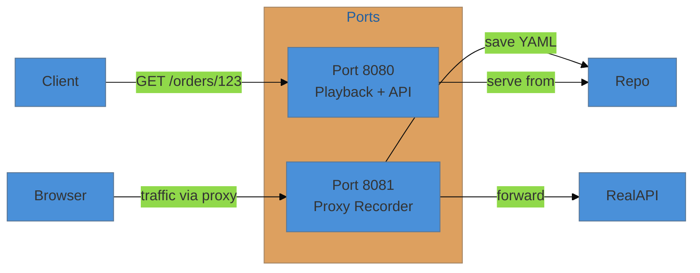

# Mock Guide

api-mock-service lets you record real HTTP traffic through a proxy and play it back instantly — no code changes required. It also lets you hand-craft scenario files with dynamic templates to simulate any API behavior, including errors, delays, and large responses.

## Architecture: Dual-Port Design



- **Port 8080** — serves mock responses, uploads/manages scenarios, runs contract tests
- **Port 8081** — transparent HTTP/HTTPS proxy that records every request/response as a YAML scenario

## Recording via Proxy

Set environment variables to route traffic through the recorder:

```bash
export http_proxy="http://localhost:8081"
export https_proxy="http://localhost:8081"

curl -k -H "Authorization: Bearer sk_test_xxxx" \
  https://api.stripe.com/v1/customers/cus_xxx/cash_balance
```

The mock service records the interaction and saves it under:
```
default_mocks_data/<path>/<METHOD>/recorded-scenario-<hash>.scr
```

### Recording in Other Languages

**Java:**
```java
System.getProperties().put("http.proxyHost", "localhost");
System.getProperties().put("http.proxyPort", "8081");
```

**Python:**
```python
proxies = {'http': 'http://localhost:8081', 'https': 'http://localhost:8081'}
resp = requests.get(url, proxies=proxies, verify=False)
```

### Recording via API (pass-through)

```bash
curl -H "X-Mock-Url: https://api.stripe.com/v1/customers/cus_xxx/cash_balance" \
     -H "Authorization: Bearer sk_test_xxx" \
     http://localhost:8080/_proxy
```

## Playback

After recording, replay instantly:

```bash
curl http://localhost:8080/v1/customers/cus_123/cash_balance
```

### Special Playback Headers

| Header | Purpose |
|--------|---------|
| `X-Mock-Scenario: <name>` | Select a specific scenario by name |
| `X-Mock-Response-Status: 503` | Override HTTP status code |
| `X-Mock-Wait-Before-Reply: 2s` | Inject artificial latency |

### Debug Headers in Response

Every mock response includes:
```
X-Mock-Path: /v1/customers/:customer/cash_balance
X-Mock-Request-Count: 13
X-Mock-Scenario: stripe-cash-balance-<hash>
```

## YAML Scenario Structure

Scenarios are YAML files. Every field is optional except `method`, `name`, and `path`.

```yaml
method: GET                        # HTTP method
name: stripe-cash-balance          # unique scenario name
path: /v1/customers/:customer/cash_balance   # supports :param wildcards
description: "Stripe cash balance"
order: 0                           # execution order within group (for chaining)
group: stripe                      # logical group name

predicate: "{{NthRequest 2}}"      # boolean gate — scenario fires only when true

request:
  # Headers that must be present (regex supported)
  assert_headers_pattern:
    Authorization: "Bearer sk_test_[0-9a-fA-F]{10}$"
    Content-Type: "application/json"
  # Query params that must match (regex supported)
  assert_query_params_pattern:
    page: "\\d+"
  # Body patterns that must match
  assert_contents_pattern: '{"userId":"(__number__[+-]?[0-9]{1,10})"}'
  path_params:
    id: "\\d{1,10}"

response:
  status_code: 200
  content_type: application/json
  headers:
    Cache-Control: ["no-cache"]
  contents: |-
    {
      "customer": "{{.customer}}",
      "balance": {{RandIntMinMax 0 10000}},
      "page": {{.page}}
    }
  contents_file: ""               # load body from a fixture file instead
  assert_contents_pattern: '{"customer":"(__string__\\w+)"}'
  assert_headers_pattern: {}
  assertions:
    - PropertyContains contents.customer cus_
    - NumPropertyGE contents.balance 0
  add_shared_variables:           # capture for use in next chained scenario
    - customer

wait_before_reply: 0s             # artificial delay (e.g. "2s", "500ms")
```

### Predicate Options

```yaml
predicate: "{{NthRequest 5}}"     # fire every 5th request
predicate: "{{GERequest 10}}"     # fire once >= 10 requests have been made
predicate: "{{LTRequest 3}}"      # fire for first 3 requests only
```

## Dynamic Templates

Scenario response bodies are Go templates with 60+ built-in helper functions.

### Loops

```yaml
contents: >
  {"devices": [
    {{- range $val := Iterate .pageSize }}
    {"id": "{{SeededUUID $val}}", "name": "{{SeededName $val}}"}
    {{if LastIter $val $.pageSize}}{{else}},{{end}}
    {{end}}
  ]}
```

### Conditional Logic

```yaml
{{if NthRequest 10}}
status_code: {{EnumInt 500 501}}
{{else}}
status_code: {{EnumInt 200 400}}
{{end}}
```

### Template Function Reference

#### Numeric

| Function | Description |
|----------|-------------|
| `{{RandIntMinMax 1 100}}` | Random int in range |
| `{{RandFloatMinMax 0.0 100.0}}` | Random float in range |
| `{{RandIntMax 1000}}` | Random int 0–max |
| `{{RandFloatMax 100.0}}` | Random float 0–max |
| `{{SeededRandom 42}}` | Deterministic random (same seed = same value) |
| `{{RandIntArrayMinMax 1 10}}` | JSON array of random ints |
| `{{Add 1 2}}` | Arithmetic addition |
| `{{EnumInt 10 20 30}}` | Pick random value from list |

#### Strings & Text

| Function | Description |
|----------|-------------|
| `{{RandString 20}}` | Random alphanumeric string |
| `{{RandStringMinMax 5 50}}` | Random string in length range |
| `{{RandRegex "^AC[0-9a-fA-F]{32}$"}}` | String matching regex |
| `{{RandParagraph 1 10}}` | Random paragraph |
| `{{RandSentence 1 10}}` | Random sentence |
| `{{RandWord 1 1}}` | Random word |
| `{{EnumString "ONE TWO THREE"}}` | Pick random string from list |
| `{{RandStringArrayMinMax 1 10}}` | JSON array of random strings |

#### Identity & Contact

| Function | Description |
|----------|-------------|
| `{{UUID}}` | Random UUID v4 |
| `{{ULID}}` | Random ULID (sortable) |
| `{{SeededUUID 42}}` | Deterministic UUID |
| `{{RandEmail}}` | Random email address |
| `{{RandPhone}}` | Random phone number |
| `{{RandURL}}` | Random URL |
| `{{RandHost}}` | Random hostname |
| `{{RandName}}` | Random full name |
| `{{RandFirstName}}` | Random first name |
| `{{RandLastName}}` | Random last name |
| `{{SeededName 0}}` | Deterministic full name |
| `{{RandUsername}}` | Random lowercase username (e.g. `alice3742`) |
| `{{RandPassword}}` | Random strong password (12–16 chars) |
| `{{RandSlug}}` | Random URL slug (e.g. `quick-brown`) |

#### Location

| Function | Description |
|----------|-------------|
| `{{RandCity}}` | Random city name |
| `{{SeededCity 0}}` | Deterministic city |
| `{{RandCountry}}` | Random country name |
| `{{RandCountryCode}}` | Random ISO country code |
| `{{RandUSState}}` | Random US state name |
| `{{RandUSStateAbbr}}` | Random US state abbreviation |
| `{{RandUSPostal}}` | Random US ZIP code |
| `{{RandAddress}}` | Random street address |
| `{{RandLatitude}}` | Random latitude (−90 to 90) |
| `{{RandLongitude}}` | Random longitude (−180 to 180) |
| `{{RandTimezone}}` | Random IANA timezone (e.g. `America/New_York`) |
| `{{SeededTimezone 0}}` | Deterministic IANA timezone |

#### Network

| Function | Description |
|----------|-------------|
| `{{RandIP}}` | Random IPv4 address |
| `{{RandIPv6}}` | Random IPv6 address |
| `{{RandMACAddress}}` | Random MAC address (e.g. `02:3a:7f:c1:4b:de`) |
| `{{RandPort}}` | Random unprivileged port (1024–65535) |

#### Crypto & Hashes

| Function | Description |
|----------|-------------|
| `{{RandSHA256}}` | Random SHA-256 hex digest (64 chars) |
| `{{RandMD5}}` | Random MD5 hex digest (32 chars) |
| `{{RandBase64}}` | Random base64-encoded string (16 bytes) |

#### Financial

| Function | Description |
|----------|-------------|
| `{{RandCurrencyCode}}` | Random ISO 4217 currency code (e.g. `USD`, `EUR`) |
| `{{SeededCurrencyCode 0}}` | Deterministic currency code |
| `{{RandCreditCard}}` | Random credit card number |
| `{{RandItin}}` | Random ITIN |
| `{{RandEin}}` | Random EIN |
| `{{RandSsn}}` | Random SSN |

#### Date/Time

| Function | Description |
|----------|-------------|
| `{{Time}}` | Current datetime (ISO 8601) |
| `{{Date}}` | Current date (`YYYY-MM-DD`) |
| `{{TimeFormat "3:04PM"}}` | Current time in custom Go format |
| `{{RandFutureDate}}` | Random ISO 8601 date 1–365 days in the future |
| `{{RandPastDate}}` | Random ISO 8601 date 1–365 days in the past |
| `{{RandUnixTimestamp}}` | Current Unix epoch timestamp |

#### Versioning & Files

| Function | Description |
|----------|-------------|
| `{{RandSemver}}` | Random semantic version (e.g. `2.14.73`) |
| `{{RandMimeType}}` | Random MIME type (e.g. `application/json`) |
| `{{RandFileExtension}}` | Random file extension without dot (e.g. `pdf`) |
| `{{RandFilename}}` | Random filename with extension (e.g. `quick_fox.pdf`) |

#### UI & Metadata

| Function | Description |
|----------|-------------|
| `{{RandHexColor}}` | Random CSS hex color (e.g. `#3a7fcb`) |
| `{{RandRGBColor}}` | Random CSS rgb() color (e.g. `rgb(58,127,203)`) |
| `{{RandHTTPStatus}}` | Random HTTP status code (e.g. `200`, `404`) |

#### Boolean & Collections

| Function | Description |
|----------|-------------|
| `{{RandBool}}` | Random true/false |
| `{{SeededBool 0}}` | Deterministic boolean |
| `{{RandDict}}` | Random JSON object |
| `{{Dict "k1" v1 "k2" v2}}` | Build JSON object from key/value pairs |

#### Request Count Predicates

| Function | Description |
|----------|-------------|
| `{{NthRequest 10}}` | True every Nth request |
| `{{GERequest 5}}` | True when request count ≥ N |
| `{{LTRequest 3}}` | True when request count < N |

#### Comparison (for predicates)

```yaml
{{if EQ .MyVar 10}}
{{if GE .MyVar 10}}
{{if GT .MyVar 10}}
{{if LE .MyVar 10}}
{{if LT .MyVar 10}}
```

#### File Fixtures

| Function | Description |
|----------|-------------|
| `{{RandFileLine "lines.txt"}}` | Random line from a fixture file |
| `{{SeededFileLine "lines.txt" 0}}` | Deterministic line from fixture |
| `{{FileProperty "props.yaml" "token"}}` | Value from YAML fixture |
| `{{JSONFileProperty "props.yaml" "amount"}}` | JSON value from fixture |
| `{{YAMLFileProperty "props.yaml" "key"}}` | YAML value from fixture |

## Test Fixtures

Upload static files that templates can reference:

```bash
# Upload a line file
curl -H "Content-Type: text/plain" --data-binary @fixtures/lines.txt \
  http://localhost:8080/_fixtures/GET/lines.txt/devices

# Upload a YAML property file
curl -H "Content-Type: application/yaml" --data-binary @fixtures/props.yaml \
  http://localhost:8080/_fixtures/GET/props.yaml/devices

# Upload a binary image
curl -H "Content-Type: image/png" --data-binary @fixtures/logo.png \
  http://localhost:8080/_fixtures/GET/logo.png/images/logo
```

Access fixtures in templates:
```yaml
"Logo": {{JSONFileProperty "props.yaml" "logoUrl"}},
"Line": {{SeededFileLine "lines.txt" $val}},
```

Serve binary files directly:
```yaml
response:
  content_type: image/png
  contents_file: logo.png
  status_code: 200
```

## Chaos Testing

### Method 1: Multiple Scenarios (Round-Robin)

Upload multiple scenarios for the same path — the mock service rotates through them:

```yaml
# scenario 1 — success
name: order-success
path: /orders/:id
response:
  status_code: 200
  contents: '{"status": "shipped"}'

# scenario 2 — error (same path, different name)
name: order-error
path: /orders/:id
response:
  status_code: 503
  contents: '{"error": "service unavailable"}'
```

### Method 2: Template Conditionals

```yaml
response:
  {{if NthRequest 5}}
  status_code: 500
  contents: '{"error": "internal error"}'
  {{else}}
  status_code: 200
  contents: '{"status": "ok"}'
  {{end}}
  wait_before_reply: {{RandIntMinMax 0 3}}s
```

### Method 3: Group Chaos Config

```bash
curl -X PUT http://localhost:8080/_groups/my-service/config -d '{
  "chaos_enabled": true,
  "mean_time_between_failure": 5,
  "mean_time_between_additional_latency": 4,
  "max_additional_latency_secs": 2.5,
  "http_errors": [400, 500, 503],
  "variables": {
    "env": "staging"
  }
}'
```

With `chaos_enabled: true`:
- ~1/5 of requests return a random HTTP error from `http_errors`
- ~1/4 of requests get up to `max_additional_latency_secs` of extra delay
- Group variables are injected into all templates for scenarios in that group

Use `global` as the group name to share variables across all scenarios.

## HAR Import / Export

```bash
# Download all scenarios as HAR
curl http://localhost:8080/_history/har

# Upload HAR file to create scenarios
curl -X POST http://localhost:8080/_history/har --data-binary @myfile.har
```

## Postman Collection Import / Export

```bash
# Download as Postman Collection
curl http://localhost:8080/_history/postman

# Upload Postman Collection
curl -X POST http://localhost:8080/_history/postman \
  -H "Content-Type: */*" --data-binary @collection.json
```

## Static Assets

Serve any static file from a user-defined directory:

```bash
# Copy file to assets directory
cp myfile.pdf default_assets/

# Access via API
curl http://localhost:8080/_assets/default_assets/myfile.pdf
```

## Browser Proxy Setup

Configure your browser to use `localhost:8081` as an HTTP proxy. You will need to import the root certificate to avoid TLS warnings:

1. Download `ca_cert.pem` from the repository root
2. Add it to your browser's trusted certificate store
3. Set proxy to `localhost:8081` in browser network settings

## Listing Scenarios

```bash
# List all scenarios
curl http://localhost:8080/_scenarios

# Get specific scenario
curl http://localhost:8080/_scenarios/GET/my-scenario-name/v1/customers/:id
```

## Uploading Scenarios

```bash
curl -H "Content-Type: application/yaml" \
  --data-binary @my-scenario.yaml \
  http://localhost:8080/_scenarios
```

## Related Docs

- [API Reference](api-reference.md) — all HTTP endpoints
- [Contract Testing](contract-testing.md) — producer/consumer contracts
- [Fuzz & Property Testing](fuzz-property-testing.md) — mutation strategies
- [OpenAPI Guide](openapi-guide.md) — spec import and schema validation
- [CLI Reference](cli-reference.md) — command-line usage
